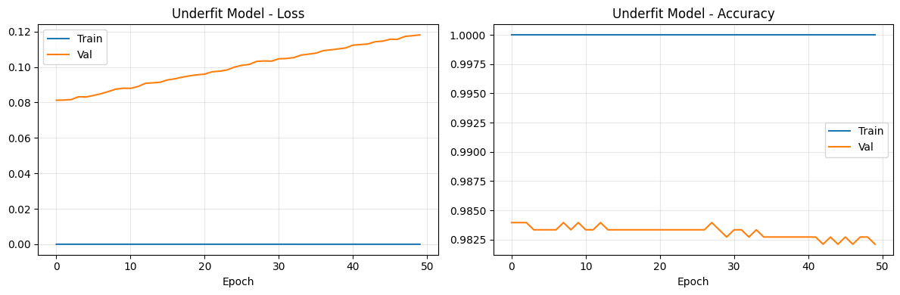
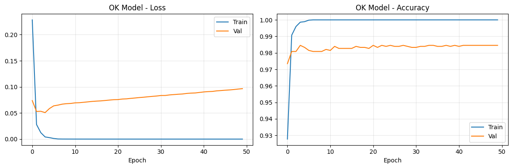
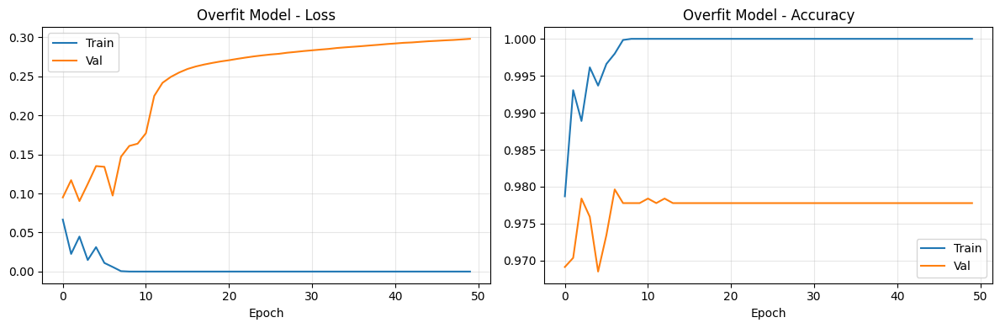
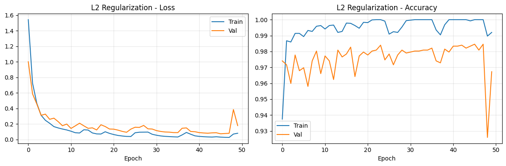
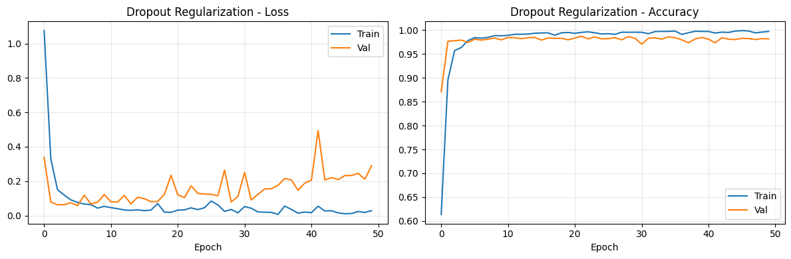
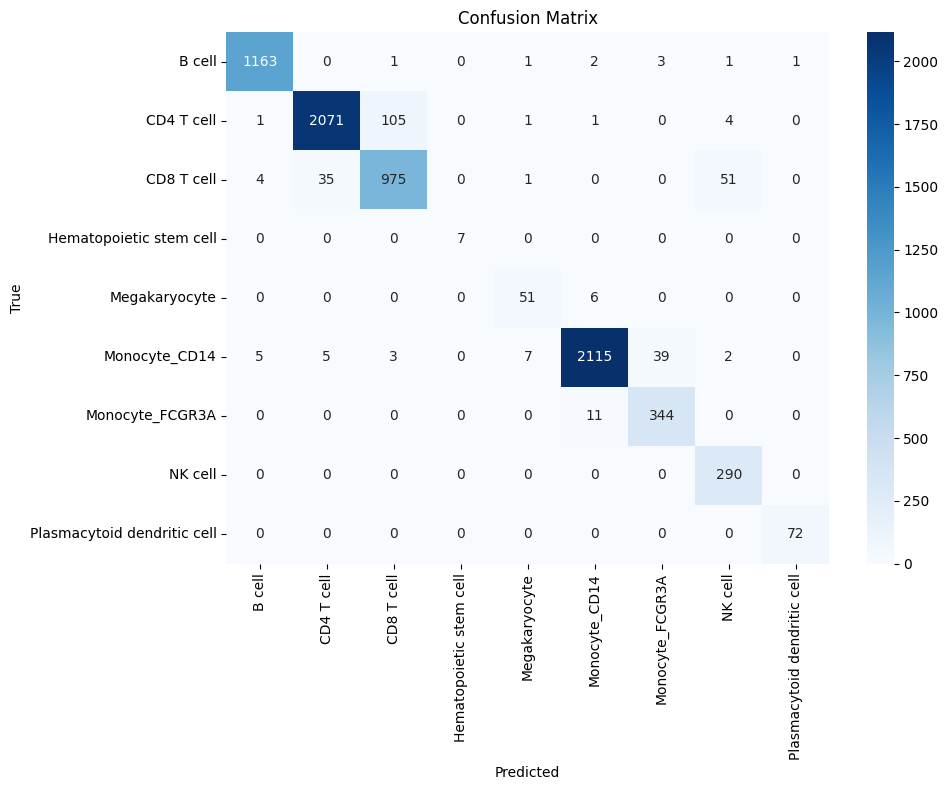
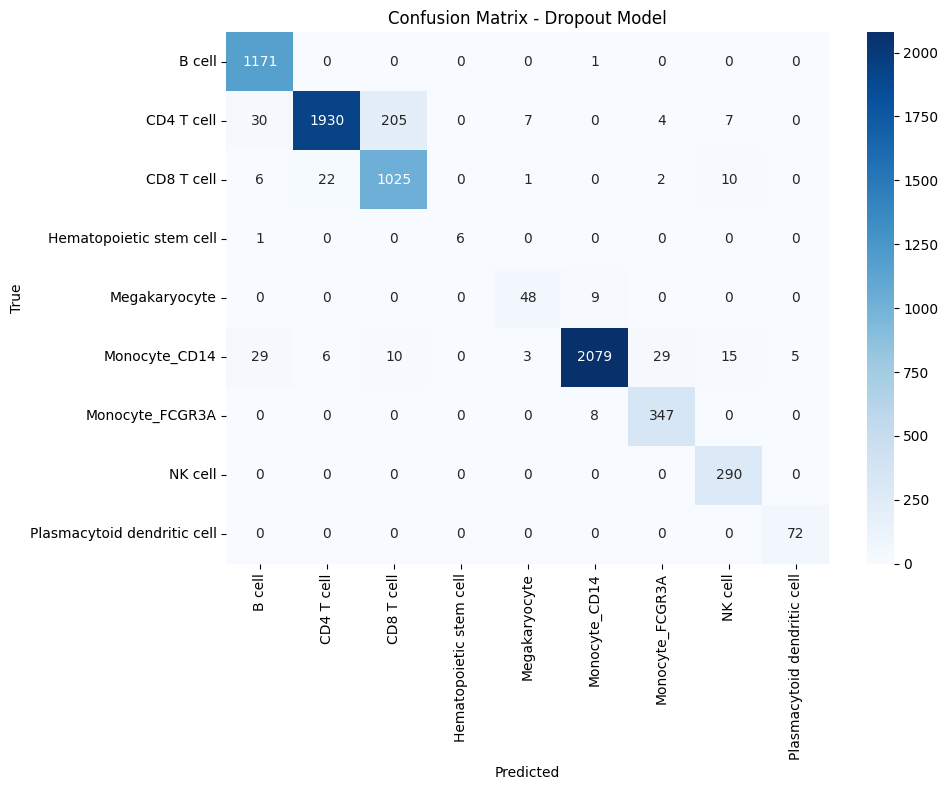
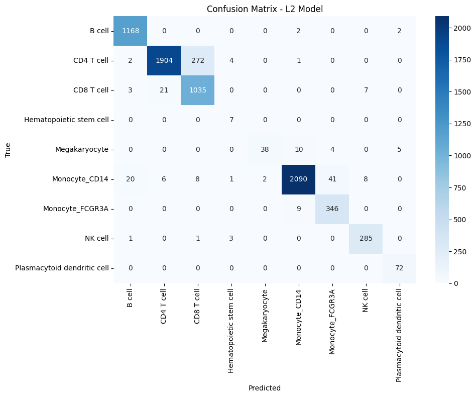
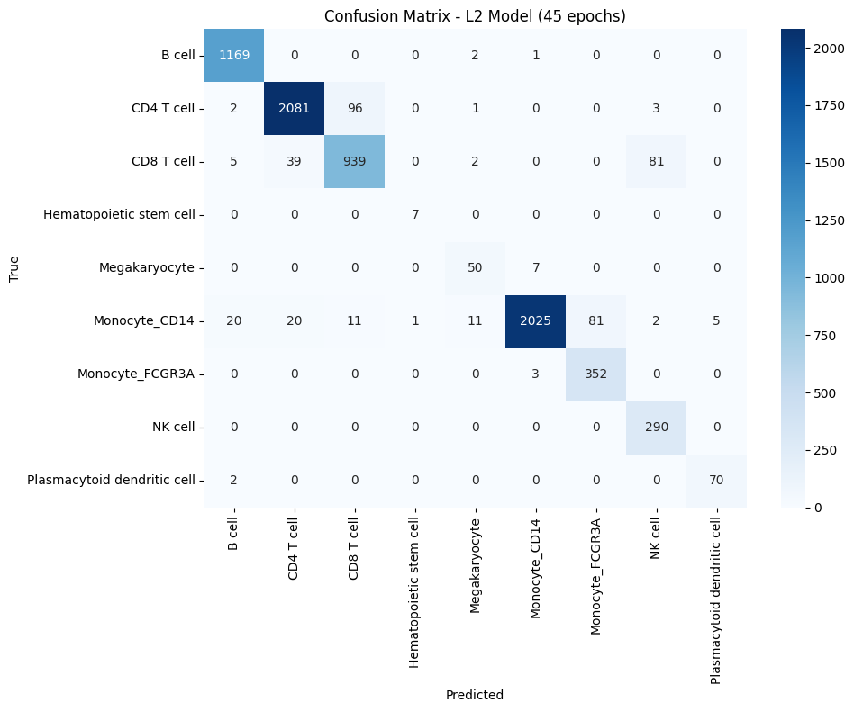

**Assignment**

1. Remember to add your name to the title of the notebook
2. The goal is to explore models that underfit and overfit, and to deal with overfitting by using the techniques seen in class.


```python
# Import needed libraries
import numpy as np
import sys, os, pdb
import pandas as pd
from matplotlib import pyplot as plt

```

Data:

Consists of the gene expression profile of several cells (coming from a patient). 

There is a train and a test datasets already provided to you.

They are organized as a matrix of cells x genes.

Given a cell, the goal is to predict the correct cell-type based on the genes' expressions for that sample.


```python
# Cambiar el directorio de trabajo a DL-HW-1 (corriendo en Docker tirando de GPU local)
target_dir = "DL-HW-1"

if os.path.isdir(target_dir):
    os.chdir(target_dir)
    print(f"Directorio cambiado a: {os.getcwd()}")
    print("Contenido del directorio:", os.listdir('.'))
else:
    raise FileNotFoundError(f"Directorio '{target_dir}' no existe. Ruta actual: {os.getcwd()}")
```

    Directorio cambiado a: /tf/DL-HW-1
    Contenido del directorio: ['ADI_scRNA_classification.ipynb', 'ADI_scRNA_classification.md', 'README.md', 'scRNA_Complete_Homework_Solution.ipynb', 'test.pkl', 'train.pkl']


```python
# Load data

# Path to source batch
train_path = "train.pkl"
# Path to target batch
test_path = "test.pkl"
# Column containing cell-types
lname = "labels" 

train_batch = pd.read_pickle(train_path)
test_batch = pd.read_pickle(test_path)
```


```python
train_batch
```


<div>
<style scoped>
    .dataframe tbody tr th:only-of-type {
        vertical-align: middle;
    }

    .dataframe tbody tr th {
        vertical-align: top;
    }

    .dataframe thead th {
        text-align: right;
    }
</style>
<table border="1" class="dataframe">
  <thead>
    <tr style="text-align: right;">
      <th>index</th>
      <th>HES4</th>
      <th>ISG15</th>
      <th>TNFRSF18</th>
      <th>TNFRSF4</th>
      <th>MMP23B</th>
      <th>UTS2</th>
      <th>TNFRSF9</th>
      <th>RBP7</th>
      <th>PGD</th>
      <th>AGTRAP</th>
      <th>...</th>
      <th>AP000692.10</th>
      <th>BACE2</th>
      <th>MX1</th>
      <th>AP001059.6</th>
      <th>AIRE</th>
      <th>COL6A2</th>
      <th>S100B</th>
      <th>MT-ATP8</th>
      <th>MT-ND6</th>
      <th>labels</th>
    </tr>
    <tr>
      <th>index</th>
      <th></th>
      <th></th>
      <th></th>
      <th></th>
      <th></th>
      <th></th>
      <th></th>
      <th></th>
      <th></th>
      <th></th>
      <th></th>
      <th></th>
      <th></th>
      <th></th>
      <th></th>
      <th></th>
      <th></th>
      <th></th>
      <th></th>
      <th></th>
      <th></th>
    </tr>
  </thead>
  <tbody>
    <tr>
      <th>data_3p-AAACCTGAGCATCATC-0</th>
      <td>-0.196407</td>
      <td>2.163650</td>
      <td>-0.186414</td>
      <td>-0.222519</td>
      <td>-0.130663</td>
      <td>-0.079505</td>
      <td>-0.089647</td>
      <td>-0.410718</td>
      <td>-0.578313</td>
      <td>-0.609471</td>
      <td>...</td>
      <td>-0.100605</td>
      <td>-0.169544</td>
      <td>3.396856</td>
      <td>-0.099155</td>
      <td>-0.064381</td>
      <td>-0.186117</td>
      <td>-0.077992</td>
      <td>-0.931465</td>
      <td>-0.777325</td>
      <td>B cell</td>
    </tr>
    <tr>
      <th>data_3p-AAACCTGAGCTAGTGG-0</th>
      <td>-0.196407</td>
      <td>1.371853</td>
      <td>-0.186414</td>
      <td>8.028668</td>
      <td>-0.130663</td>
      <td>-0.079505</td>
      <td>-0.089647</td>
      <td>-0.410718</td>
      <td>1.221355</td>
      <td>-0.609471</td>
      <td>...</td>
      <td>-0.100605</td>
      <td>-0.169544</td>
      <td>-0.382577</td>
      <td>-0.099155</td>
      <td>-0.064381</td>
      <td>-0.186117</td>
      <td>-0.077992</td>
      <td>-0.931465</td>
      <td>-0.777325</td>
      <td>CD4 T cell</td>
    </tr>
    <tr>
      <th>data_3p-AAACCTGCACATTAGC-0</th>
      <td>-0.196407</td>
      <td>-0.564395</td>
      <td>-0.186414</td>
      <td>-0.222519</td>
      <td>-0.130663</td>
      <td>-0.079505</td>
      <td>-0.089647</td>
      <td>-0.410718</td>
      <td>1.770606</td>
      <td>-0.609471</td>
      <td>...</td>
      <td>-0.100605</td>
      <td>-0.169544</td>
      <td>-0.382577</td>
      <td>-0.099155</td>
      <td>-0.064381</td>
      <td>-0.186117</td>
      <td>-0.077992</td>
      <td>-0.931465</td>
      <td>0.840558</td>
      <td>CD4 T cell</td>
    </tr>
    <tr>
      <th>data_3p-AAACCTGCACTGTTAG-0</th>
      <td>-0.196407</td>
      <td>-0.564395</td>
      <td>-0.186414</td>
      <td>-0.222519</td>
      <td>-0.130663</td>
      <td>-0.079505</td>
      <td>-0.089647</td>
      <td>2.437211</td>
      <td>-0.578313</td>
      <td>1.062532</td>
      <td>...</td>
      <td>-0.100605</td>
      <td>-0.169544</td>
      <td>-0.382577</td>
      <td>8.922243</td>
      <td>-0.064381</td>
      <td>-0.186117</td>
      <td>-0.077992</td>
      <td>-0.931465</td>
      <td>-0.777325</td>
      <td>Monocyte_CD14</td>
    </tr>
    <tr>
      <th>data_3p-AAACCTGCATAGTAAG-0</th>
      <td>-0.196407</td>
      <td>-0.564395</td>
      <td>-0.186414</td>
      <td>-0.222519</td>
      <td>-0.130663</td>
      <td>-0.079505</td>
      <td>-0.089647</td>
      <td>1.606579</td>
      <td>-0.578313</td>
      <td>1.112563</td>
      <td>...</td>
      <td>-0.100605</td>
      <td>-0.169544</td>
      <td>-0.382577</td>
      <td>-0.099155</td>
      <td>-0.064381</td>
      <td>-0.186117</td>
      <td>-0.077992</td>
      <td>-0.931465</td>
      <td>-0.777325</td>
      <td>Monocyte_CD14</td>
    </tr>
    <tr>
      <th>...</th>
      <td>...</td>
      <td>...</td>
      <td>...</td>
      <td>...</td>
      <td>...</td>
      <td>...</td>
      <td>...</td>
      <td>...</td>
      <td>...</td>
      <td>...</td>
      <td>...</td>
      <td>...</td>
      <td>...</td>
      <td>...</td>
      <td>...</td>
      <td>...</td>
      <td>...</td>
      <td>...</td>
      <td>...</td>
      <td>...</td>
      <td>...</td>
    </tr>
    <tr>
      <th>data_3p-TTTGTCATCATGTCCC-0</th>
      <td>-0.196407</td>
      <td>-0.564395</td>
      <td>-0.186414</td>
      <td>-0.222519</td>
      <td>-0.130663</td>
      <td>-0.079505</td>
      <td>-0.089647</td>
      <td>-0.410718</td>
      <td>-0.578313</td>
      <td>-0.609471</td>
      <td>...</td>
      <td>-0.100605</td>
      <td>-0.169544</td>
      <td>-0.382577</td>
      <td>-0.099155</td>
      <td>-0.064381</td>
      <td>-0.186117</td>
      <td>-0.077992</td>
      <td>-0.931465</td>
      <td>-0.777325</td>
      <td>CD8 T cell</td>
    </tr>
    <tr>
      <th>data_3p-TTTGTCATCCGATATG-0</th>
      <td>-0.196407</td>
      <td>-0.564395</td>
      <td>-0.186414</td>
      <td>-0.222519</td>
      <td>-0.130663</td>
      <td>-0.079505</td>
      <td>-0.089647</td>
      <td>-0.410718</td>
      <td>-0.578313</td>
      <td>-0.609471</td>
      <td>...</td>
      <td>-0.100605</td>
      <td>-0.169544</td>
      <td>2.025987</td>
      <td>-0.099155</td>
      <td>-0.064381</td>
      <td>-0.186117</td>
      <td>-0.077992</td>
      <td>-0.931465</td>
      <td>0.335671</td>
      <td>CD8 T cell</td>
    </tr>
    <tr>
      <th>data_3p-TTTGTCATCGTCTGAA-0</th>
      <td>-0.196407</td>
      <td>-0.564395</td>
      <td>-0.186414</td>
      <td>-0.222519</td>
      <td>-0.130663</td>
      <td>-0.079505</td>
      <td>-0.089647</td>
      <td>1.252710</td>
      <td>0.921344</td>
      <td>-0.609471</td>
      <td>...</td>
      <td>-0.100605</td>
      <td>-0.169544</td>
      <td>-0.382577</td>
      <td>-0.099155</td>
      <td>-0.064381</td>
      <td>-0.186117</td>
      <td>-0.077992</td>
      <td>-0.931465</td>
      <td>-0.777325</td>
      <td>Monocyte_CD14</td>
    </tr>
    <tr>
      <th>data_3p-TTTGTCATCTCGAGTA-0</th>
      <td>-0.196407</td>
      <td>-0.564395</td>
      <td>-0.186414</td>
      <td>-0.222519</td>
      <td>-0.130663</td>
      <td>-0.079505</td>
      <td>-0.089647</td>
      <td>-0.410718</td>
      <td>-0.578313</td>
      <td>-0.609471</td>
      <td>...</td>
      <td>-0.100605</td>
      <td>-0.169544</td>
      <td>-0.382577</td>
      <td>-0.099155</td>
      <td>-0.064381</td>
      <td>-0.186117</td>
      <td>-0.077992</td>
      <td>-0.931465</td>
      <td>-0.777325</td>
      <td>CD8 T cell</td>
    </tr>
    <tr>
      <th>data_3p-TTTGTCATCTGCTTGC-0</th>
      <td>-0.196407</td>
      <td>-0.564395</td>
      <td>-0.186414</td>
      <td>-0.222519</td>
      <td>-0.130663</td>
      <td>-0.079505</td>
      <td>-0.089647</td>
      <td>-0.410718</td>
      <td>1.346185</td>
      <td>-0.609471</td>
      <td>...</td>
      <td>-0.100605</td>
      <td>-0.169544</td>
      <td>-0.382577</td>
      <td>-0.099155</td>
      <td>-0.064381</td>
      <td>-0.186117</td>
      <td>-0.077992</td>
      <td>-0.931465</td>
      <td>-0.777325</td>
      <td>CD8 T cell</td>
    </tr>
  </tbody>
</table>
<p>8098 rows × 1200 columns</p>
</div>


```python
# Extract the common genes so that we can use the same network for both batches

common_genes = list(set(train_batch.columns).intersection(set(test_batch.columns)))
common_genes.sort()
train_batch = train_batch[list(common_genes)]
test_batch = test_batch[list(common_genes)]

train_mat = train_batch.drop(lname, axis=1)
train_labels = train_batch[lname]

test_mat = test_batch.drop(lname, axis=1)
test_labels = test_batch[lname]

# values are already normalized (ignore this)
mat = train_mat.values
mat_round = np.rint(mat)
error = np.mean(np.abs(mat - mat_round))

```


```python
train_labels.unique()
len(train_labels.unique()   )
```


    9


## 2. Preguntas Teoricas (Q1-Q6)

### Q1: Que tipo de problema estamos resolviendo?

**Respuesta:** Problema de clasificacion multiclase. Dado el perfil de expresion genica de una celula, predecir su tipo celular.

### Q2: Cual es el tamano de la entrada (numero de features)?

**Respuesta:** El numero de genes comunes entre train y test es 9.

### Q3: Cuantas neuronas debemos tener en la ultima capa?

**Respuesta:** Una neurona por cada clase (tipo celular).

### Q4: Cual es la funcion de activacion mas apropiada para la ultima capa?

**Respuesta:** Softmax, para obtener probabilidades que sumen 1.


```python
# Procesar etiquetas: convertir a enteros y one-hot
from sklearn.preprocessing import LabelEncoder
from tensorflow.keras.utils import to_categorical

label_encoder = LabelEncoder()
train_labels_int = label_encoder.fit_transform(train_labels)
test_labels_int = label_encoder.transform(test_labels)

num_classes = len(label_encoder.classes_)
n_features = train_mat.shape[1]

train_labels_onehot = to_categorical(train_labels_int, num_classes)
test_labels_onehot = to_categorical(test_labels_int, num_classes)

print(f"Numero de clases: {num_classes}")
print(f"Numero de features: {n_features}")
print(f"Mapeo: {dict(zip(label_encoder.classes_, range(num_classes)))}")

```

    2025-11-21 14:45:15.653130: I tensorflow/core/util/port.cc:113] oneDNN custom operations are on. You may see slightly different numerical results due to floating-point round-off errors from different computation orders. To turn them off, set the environment variable `TF_ENABLE_ONEDNN_OPTS=0`.
    2025-11-21 14:45:15.850068: E external/local_xla/xla/stream_executor/cuda/cuda_dnn.cc:9261] Unable to register cuDNN factory: Attempting to register factory for plugin cuDNN when one has already been registered
    2025-11-21 14:45:15.850157: E external/local_xla/xla/stream_executor/cuda/cuda_fft.cc:607] Unable to register cuFFT factory: Attempting to register factory for plugin cuFFT when one has already been registered
    2025-11-21 14:45:15.890136: E external/local_xla/xla/stream_executor/cuda/cuda_blas.cc:1515] Unable to register cuBLAS factory: Attempting to register factory for plugin cuBLAS when one has already been registered
    2025-11-21 14:45:15.994566: I tensorflow/core/platform/cpu_feature_guard.cc:182] This TensorFlow binary is optimized to use available CPU instructions in performance-critical operations.
    To enable the following instructions: AVX2 AVX_VNNI FMA, in other operations, rebuild TensorFlow with the appropriate compiler flags.


    Numero de clases: 9
    Numero de features: 1199
    Mapeo: {'B cell': 0, 'CD4 T cell': 1, 'CD8 T cell': 2, 'Hematopoietic stem cell': 3, 'Megakaryocyte': 4, 'Monocyte_CD14': 5, 'Monocyte_FCGR3A': 6, 'NK cell': 7, 'Plasmacytoid dendritic cell': 8}


### Q5: Como se modificaron las etiquetas?

**Respuesta:** Se convirtieron de textos a enteros (LabelEncoder) y luego a one-hot encoding para usar con categorical_crossentropy.

### Q6: Que funcion de perdida se usara?

**Respuesta:** Categorical cross-entropy, la perdida estandar para clasificacion multiclase con one-hot encoding.


## 3. Entrenamiento de Modelos

Entrenaremos 3 modelos sin regularizacion:
1. Underfit: Muy pocas capas/neuronas
2. OK: Arquitectura razonable
3. Overfit: Muchas capas/neuronas

Luego aplicaremos regularizacion (L2, Dropout) al modelo que overfit.


```python
# Preparar datos
from sklearn.model_selection import train_test_split

X_train_full = train_mat.values.astype('float32')
X_test = test_mat.values.astype('float32')
y_train_full = train_labels_onehot
y_test = test_labels_onehot

# Split train/validation
X_train, X_val, y_train, y_val = train_test_split(
    X_train_full, y_train_full, test_size=0.2, random_state=42,
    stratify=np.argmax(y_train_full, axis=1)
)

print(f"X_train: {X_train.shape}, X_val: {X_val.shape}, X_test: {X_test.shape}")

```

    X_train: (6478, 1199), X_val: (1620, 1199), X_test: (7378, 1199)


```python
# Importar TensorFlow/Keras
import tensorflow as tf
from tensorflow.keras import models, layers, regularizers

tf.random.set_seed(42)
print(f"TensorFlow version: {tf.__version__}")

```

    TensorFlow version: 2.15.0


### Modelo 1: Underfit


```python
# Modelo con capacidad insuficiente
def create_underfit_model():
    model = models.Sequential([
        layers.Dense(16, activation='relu', input_shape=(n_features,)),
        layers.Dense(num_classes, activation='softmax')
    ], name='Underfit')
    model.compile(optimizer='adam', loss='categorical_crossentropy', metrics=['accuracy'])
    return model

model_underfit = create_underfit_model()
model_underfit.summary()

```

    2025-11-21 14:48:17.952335: I external/local_xla/xla/stream_executor/cuda/cuda_executor.cc:887] could not open file to read NUMA node: /sys/bus/pci/devices/0000:01:00.0/numa_node
    Your kernel may have been built without NUMA support.
    2025-11-21 14:48:18.013673: I external/local_xla/xla/stream_executor/cuda/cuda_executor.cc:887] could not open file to read NUMA node: /sys/bus/pci/devices/0000:01:00.0/numa_node
    Your kernel may have been built without NUMA support.
    2025-11-21 14:48:18.013723: I external/local_xla/xla/stream_executor/cuda/cuda_executor.cc:887] could not open file to read NUMA node: /sys/bus/pci/devices/0000:01:00.0/numa_node
    Your kernel may have been built without NUMA support.
    2025-11-21 14:48:18.017077: I external/local_xla/xla/stream_executor/cuda/cuda_executor.cc:887] could not open file to read NUMA node: /sys/bus/pci/devices/0000:01:00.0/numa_node
    Your kernel may have been built without NUMA support.
    2025-11-21 14:48:18.017119: I external/local_xla/xla/stream_executor/cuda/cuda_executor.cc:887] could not open file to read NUMA node: /sys/bus/pci/devices/0000:01:00.0/numa_node
    Your kernel may have been built without NUMA support.
    2025-11-21 14:48:18.017135: I external/local_xla/xla/stream_executor/cuda/cuda_executor.cc:887] could not open file to read NUMA node: /sys/bus/pci/devices/0000:01:00.0/numa_node
    Your kernel may have been built without NUMA support.
    2025-11-21 14:48:18.178527: I external/local_xla/xla/stream_executor/cuda/cuda_executor.cc:887] could not open file to read NUMA node: /sys/bus/pci/devices/0000:01:00.0/numa_node
    Your kernel may have been built without NUMA support.
    2025-11-21 14:48:18.179088: I external/local_xla/xla/stream_executor/cuda/cuda_executor.cc:887] could not open file to read NUMA node: /sys/bus/pci/devices/0000:01:00.0/numa_node
    Your kernel may have been built without NUMA support.
    2025-11-21 14:48:18.179103: I tensorflow/core/common_runtime/gpu/gpu_device.cc:2022] Could not identify NUMA node of platform GPU id 0, defaulting to 0.  Your kernel may not have been built with NUMA support.
    2025-11-21 14:48:18.179178: I external/local_xla/xla/stream_executor/cuda/cuda_executor.cc:887] could not open file to read NUMA node: /sys/bus/pci/devices/0000:01:00.0/numa_node
    Your kernel may have been built without NUMA support.
    2025-11-21 14:48:18.179469: I tensorflow/core/common_runtime/gpu/gpu_device.cc:1929] Created device /job:localhost/replica:0/task:0/device:GPU:0 with 5564 MB memory:  -> device: 0, name: NVIDIA GeForce RTX 3070 Ti Laptop GPU, pci bus id: 0000:01:00.0, compute capability: 8.6


    Model: "Underfit"
    _________________________________________________________________
     Layer (type)                Output Shape              Param #   
    =================================================================
     dense (Dense)               (None, 16)                19200     
                                                                     
     dense_1 (Dense)             (None, 9)                 153       
                                                                     
    =================================================================
    Total params: 19353 (75.60 KB)
    Trainable params: 19353 (75.60 KB)
    Non-trainable params: 0 (0.00 Byte)
    _________________________________________________________________


```python
# Entrenar modelo underfit
history_underfit = model_underfit.fit(
    X_train, y_train, epochs=50, batch_size=32,
    validation_data=(X_val, y_val), verbose=1
)

print(f"Train acc: {history_underfit.history['accuracy'][-1]:.4f}")
print(f"Val acc: {history_underfit.history['val_accuracy'][-1]:.4f}")

```

    Epoch 1/50
    203/203 [==============================] - 1s 6ms/step - loss: 5.0832e-06 - accuracy: 1.0000 - val_loss: 0.0813 - val_accuracy: 0.9840
    Epoch 2/50
    203/203 [==============================] - 1s 5ms/step - loss: 4.6182e-06 - accuracy: 1.0000 - val_loss: 0.0814 - val_accuracy: 0.9840
    Epoch 3/50
    203/203 [==============================] - 1s 5ms/step - loss: 4.0430e-06 - accuracy: 1.0000 - val_loss: 0.0816 - val_accuracy: 0.9840
    Epoch 4/50
    203/203 [==============================] - 1s 5ms/step - loss: 3.6062e-06 - accuracy: 1.0000 - val_loss: 0.0832 - val_accuracy: 0.9833
    Epoch 5/50
    203/203 [==============================] - 1s 5ms/step - loss: 3.2344e-06 - accuracy: 1.0000 - val_loss: 0.0831 - val_accuracy: 0.9833
    Epoch 6/50
    203/203 [==============================] - 1s 5ms/step - loss: 2.8815e-06 - accuracy: 1.0000 - val_loss: 0.0839 - val_accuracy: 0.9833
    Epoch 7/50
    203/203 [==============================] - 1s 5ms/step - loss: 2.5515e-06 - accuracy: 1.0000 - val_loss: 0.0849 - val_accuracy: 0.9833
    Epoch 8/50
    203/203 [==============================] - 1s 5ms/step - loss: 2.2846e-06 - accuracy: 1.0000 - val_loss: 0.0862 - val_accuracy: 0.9840
    Epoch 9/50
    203/203 [==============================] - 1s 6ms/step - loss: 2.0584e-06 - accuracy: 1.0000 - val_loss: 0.0875 - val_accuracy: 0.9833
    Epoch 10/50
    203/203 [==============================] - 1s 5ms/step - loss: 1.8410e-06 - accuracy: 1.0000 - val_loss: 0.0880 - val_accuracy: 0.9840
    Epoch 11/50
    203/203 [==============================] - 1s 5ms/step - loss: 1.6300e-06 - accuracy: 1.0000 - val_loss: 0.0880 - val_accuracy: 0.9833
    Epoch 12/50
    203/203 [==============================] - 1s 5ms/step - loss: 1.4594e-06 - accuracy: 1.0000 - val_loss: 0.0890 - val_accuracy: 0.9833
    Epoch 13/50
    203/203 [==============================] - 1s 5ms/step - loss: 1.2995e-06 - accuracy: 1.0000 - val_loss: 0.0908 - val_accuracy: 0.9840
    Epoch 14/50
    203/203 [==============================] - 1s 5ms/step - loss: 1.1795e-06 - accuracy: 1.0000 - val_loss: 0.0911 - val_accuracy: 0.9833
    Epoch 15/50
    203/203 [==============================] - 1s 5ms/step - loss: 1.0374e-06 - accuracy: 1.0000 - val_loss: 0.0914 - val_accuracy: 0.9833
    Epoch 16/50
    203/203 [==============================] - 1s 5ms/step - loss: 9.3519e-07 - accuracy: 1.0000 - val_loss: 0.0927 - val_accuracy: 0.9833
    Epoch 17/50
    203/203 [==============================] - 1s 5ms/step - loss: 8.2830e-07 - accuracy: 1.0000 - val_loss: 0.0934 - val_accuracy: 0.9833
    Epoch 18/50
    203/203 [==============================] - 1s 5ms/step - loss: 7.4135e-07 - accuracy: 1.0000 - val_loss: 0.0943 - val_accuracy: 0.9833
    Epoch 19/50
    203/203 [==============================] - 1s 5ms/step - loss: 6.6214e-07 - accuracy: 1.0000 - val_loss: 0.0951 - val_accuracy: 0.9833
    Epoch 20/50
    203/203 [==============================] - 1s 5ms/step - loss: 5.9244e-07 - accuracy: 1.0000 - val_loss: 0.0956 - val_accuracy: 0.9833
    Epoch 21/50
    203/203 [==============================] - 1s 5ms/step - loss: 5.2926e-07 - accuracy: 1.0000 - val_loss: 0.0960 - val_accuracy: 0.9833
    Epoch 22/50
    203/203 [==============================] - 1s 5ms/step - loss: 4.7715e-07 - accuracy: 1.0000 - val_loss: 0.0973 - val_accuracy: 0.9833
    Epoch 23/50
    203/203 [==============================] - 1s 5ms/step - loss: 4.2842e-07 - accuracy: 1.0000 - val_loss: 0.0976 - val_accuracy: 0.9833
    Epoch 24/50
    203/203 [==============================] - 1s 5ms/step - loss: 3.8361e-07 - accuracy: 1.0000 - val_loss: 0.0983 - val_accuracy: 0.9833
    Epoch 25/50
    203/203 [==============================] - 1s 5ms/step - loss: 3.4487e-07 - accuracy: 1.0000 - val_loss: 0.1000 - val_accuracy: 0.9833
    Epoch 26/50
    203/203 [==============================] - 1s 5ms/step - loss: 3.1050e-07 - accuracy: 1.0000 - val_loss: 0.1009 - val_accuracy: 0.9833
    Epoch 27/50
    203/203 [==============================] - 4s 19ms/step - loss: 2.7528e-07 - accuracy: 1.0000 - val_loss: 0.1015 - val_accuracy: 0.9833
    Epoch 28/50
    203/203 [==============================] - 1s 5ms/step - loss: 2.4550e-07 - accuracy: 1.0000 - val_loss: 0.1032 - val_accuracy: 0.9840
    Epoch 29/50
    203/203 [==============================] - 1s 5ms/step - loss: 2.2114e-07 - accuracy: 1.0000 - val_loss: 0.1034 - val_accuracy: 0.9833
    Epoch 30/50
    203/203 [==============================] - 1s 5ms/step - loss: 1.9919e-07 - accuracy: 1.0000 - val_loss: 0.1033 - val_accuracy: 0.9827
    Epoch 31/50
    203/203 [==============================] - 1s 5ms/step - loss: 1.7528e-07 - accuracy: 1.0000 - val_loss: 0.1046 - val_accuracy: 0.9833
    Epoch 32/50
    203/203 [==============================] - 1s 5ms/step - loss: 1.5848e-07 - accuracy: 1.0000 - val_loss: 0.1048 - val_accuracy: 0.9833
    Epoch 33/50
    203/203 [==============================] - 1s 5ms/step - loss: 1.4405e-07 - accuracy: 1.0000 - val_loss: 0.1053 - val_accuracy: 0.9827
    Epoch 34/50
    203/203 [==============================] - 1s 6ms/step - loss: 1.2832e-07 - accuracy: 1.0000 - val_loss: 0.1067 - val_accuracy: 0.9833
    Epoch 35/50
    203/203 [==============================] - 1s 5ms/step - loss: 1.1522e-07 - accuracy: 1.0000 - val_loss: 0.1073 - val_accuracy: 0.9827
    Epoch 36/50
    203/203 [==============================] - 1s 5ms/step - loss: 1.0250e-07 - accuracy: 1.0000 - val_loss: 0.1078 - val_accuracy: 0.9827
    Epoch 37/50
    203/203 [==============================] - 1s 5ms/step - loss: 9.2232e-08 - accuracy: 1.0000 - val_loss: 0.1093 - val_accuracy: 0.9827
    Epoch 38/50
    203/203 [==============================] - 1s 5ms/step - loss: 8.2755e-08 - accuracy: 1.0000 - val_loss: 0.1097 - val_accuracy: 0.9827
    Epoch 39/50
    203/203 [==============================] - 1s 5ms/step - loss: 7.4234e-08 - accuracy: 1.0000 - val_loss: 0.1102 - val_accuracy: 0.9827
    Epoch 40/50
    203/203 [==============================] - 1s 5ms/step - loss: 6.7168e-08 - accuracy: 1.0000 - val_loss: 0.1108 - val_accuracy: 0.9827
    Epoch 41/50
    203/203 [==============================] - 1s 5ms/step - loss: 6.0304e-08 - accuracy: 1.0000 - val_loss: 0.1123 - val_accuracy: 0.9827
    Epoch 42/50
    203/203 [==============================] - 1s 5ms/step - loss: 5.3918e-08 - accuracy: 1.0000 - val_loss: 0.1127 - val_accuracy: 0.9827
    Epoch 43/50
    203/203 [==============================] - 1s 6ms/step - loss: 4.8913e-08 - accuracy: 1.0000 - val_loss: 0.1130 - val_accuracy: 0.9821
    Epoch 44/50
    203/203 [==============================] - 1s 5ms/step - loss: 4.4073e-08 - accuracy: 1.0000 - val_loss: 0.1143 - val_accuracy: 0.9827
    Epoch 45/50
    203/203 [==============================] - 1s 5ms/step - loss: 3.9583e-08 - accuracy: 1.0000 - val_loss: 0.1146 - val_accuracy: 0.9821
    Epoch 46/50
    203/203 [==============================] - 1s 5ms/step - loss: 3.5571e-08 - accuracy: 1.0000 - val_loss: 0.1157 - val_accuracy: 0.9827
    Epoch 47/50
    203/203 [==============================] - 1s 5ms/step - loss: 3.1891e-08 - accuracy: 1.0000 - val_loss: 0.1156 - val_accuracy: 0.9821
    Epoch 48/50
    203/203 [==============================] - 1s 5ms/step - loss: 2.9388e-08 - accuracy: 1.0000 - val_loss: 0.1173 - val_accuracy: 0.9827
    Epoch 49/50
    203/203 [==============================] - 1s 5ms/step - loss: 2.5781e-08 - accuracy: 1.0000 - val_loss: 0.1177 - val_accuracy: 0.9827
    Epoch 50/50
    203/203 [==============================] - 1s 5ms/step - loss: 2.3444e-08 - accuracy: 1.0000 - val_loss: 0.1181 - val_accuracy: 0.9821
    Train acc: 1.0000
    Val acc: 0.9821


### Modelo 2: Bien Ajustado


```python
# Modelo con capacidad adecuada
def create_ok_model():
    model = models.Sequential([
        layers.Dense(128, activation='relu', input_shape=(n_features,)),
        layers.Dense(64, activation='relu'),
        layers.Dense(32, activation='relu'),
        layers.Dense(num_classes, activation='softmax')
    ], name='OK')
    model.compile(optimizer='adam', loss='categorical_crossentropy', metrics=['accuracy'])
    return model

model_ok = create_ok_model()
model_ok.summary()

```

    Model: "OK"
    _________________________________________________________________
     Layer (type)                Output Shape              Param #   
    =================================================================
     dense_2 (Dense)             (None, 128)               153600    
                                                                     
     dense_3 (Dense)             (None, 64)                8256      
                                                                     
     dense_4 (Dense)             (None, 32)                2080      
                                                                     
     dense_5 (Dense)             (None, 9)                 297       
                                                                     
    =================================================================
    Total params: 164233 (641.54 KB)
    Trainable params: 164233 (641.54 KB)
    Non-trainable params: 0 (0.00 Byte)
    _________________________________________________________________


```python
# Entrenar modelo OK
history_ok = model_ok.fit(
    X_train, y_train, epochs=50, batch_size=32,
    validation_data=(X_val, y_val), verbose=1
)

print(f"Train acc: {history_ok.history['accuracy'][-1]:.4f}")
print(f"Val acc: {history_ok.history['val_accuracy'][-1]:.4f}")

```

    Epoch 1/50
    203/203 [==============================] - 2s 7ms/step - loss: 0.2283 - accuracy: 0.9278 - val_loss: 0.0737 - val_accuracy: 0.9735
    Epoch 2/50
    203/203 [==============================] - 1s 6ms/step - loss: 0.0279 - accuracy: 0.9907 - val_loss: 0.0529 - val_accuracy: 0.9809
    Epoch 3/50
    203/203 [==============================] - 1s 6ms/step - loss: 0.0123 - accuracy: 0.9960 - val_loss: 0.0533 - val_accuracy: 0.9809
    Epoch 4/50
    203/203 [==============================] - 1s 6ms/step - loss: 0.0041 - accuracy: 0.9986 - val_loss: 0.0507 - val_accuracy: 0.9846
    Epoch 5/50
    203/203 [==============================] - 1s 6ms/step - loss: 0.0028 - accuracy: 0.9989 - val_loss: 0.0584 - val_accuracy: 0.9833
    Epoch 6/50
    203/203 [==============================] - 1s 6ms/step - loss: 0.0012 - accuracy: 0.9998 - val_loss: 0.0636 - val_accuracy: 0.9815
    Epoch 7/50
    203/203 [==============================] - 1s 6ms/step - loss: 2.4023e-04 - accuracy: 1.0000 - val_loss: 0.0651 - val_accuracy: 0.9809
    Epoch 8/50
    203/203 [==============================] - 1s 6ms/step - loss: 1.0841e-04 - accuracy: 1.0000 - val_loss: 0.0669 - val_accuracy: 0.9809
    Epoch 9/50
    203/203 [==============================] - 1s 6ms/step - loss: 7.7257e-05 - accuracy: 1.0000 - val_loss: 0.0678 - val_accuracy: 0.9809
    Epoch 10/50
    203/203 [==============================] - 1s 6ms/step - loss: 5.9734e-05 - accuracy: 1.0000 - val_loss: 0.0683 - val_accuracy: 0.9821
    Epoch 11/50
    203/203 [==============================] - 1s 6ms/step - loss: 4.7616e-05 - accuracy: 1.0000 - val_loss: 0.0694 - val_accuracy: 0.9815
    Epoch 12/50
    203/203 [==============================] - 1s 6ms/step - loss: 3.8605e-05 - accuracy: 1.0000 - val_loss: 0.0697 - val_accuracy: 0.9840
    Epoch 13/50
    203/203 [==============================] - 1s 6ms/step - loss: 3.2121e-05 - accuracy: 1.0000 - val_loss: 0.0705 - val_accuracy: 0.9827
    Epoch 14/50
    203/203 [==============================] - 4s 20ms/step - loss: 2.6894e-05 - accuracy: 1.0000 - val_loss: 0.0713 - val_accuracy: 0.9827
    Epoch 15/50
    203/203 [==============================] - 1s 6ms/step - loss: 2.2882e-05 - accuracy: 1.0000 - val_loss: 0.0722 - val_accuracy: 0.9827
    Epoch 16/50
    203/203 [==============================] - 1s 6ms/step - loss: 1.9337e-05 - accuracy: 1.0000 - val_loss: 0.0727 - val_accuracy: 0.9827
    Epoch 17/50
    203/203 [==============================] - 1s 6ms/step - loss: 1.6548e-05 - accuracy: 1.0000 - val_loss: 0.0732 - val_accuracy: 0.9840
    Epoch 18/50
    203/203 [==============================] - 1s 6ms/step - loss: 1.4223e-05 - accuracy: 1.0000 - val_loss: 0.0739 - val_accuracy: 0.9833
    Epoch 19/50
    203/203 [==============================] - 1s 6ms/step - loss: 1.2302e-05 - accuracy: 1.0000 - val_loss: 0.0747 - val_accuracy: 0.9833
    Epoch 20/50
    203/203 [==============================] - 1s 7ms/step - loss: 1.0723e-05 - accuracy: 1.0000 - val_loss: 0.0755 - val_accuracy: 0.9827
    Epoch 21/50
    203/203 [==============================] - 1s 6ms/step - loss: 9.3192e-06 - accuracy: 1.0000 - val_loss: 0.0757 - val_accuracy: 0.9846
    Epoch 22/50
    203/203 [==============================] - 1s 6ms/step - loss: 8.1612e-06 - accuracy: 1.0000 - val_loss: 0.0767 - val_accuracy: 0.9833
    Epoch 23/50
    203/203 [==============================] - 1s 6ms/step - loss: 7.0981e-06 - accuracy: 1.0000 - val_loss: 0.0771 - val_accuracy: 0.9846
    Epoch 24/50
    203/203 [==============================] - 1s 6ms/step - loss: 6.2607e-06 - accuracy: 1.0000 - val_loss: 0.0780 - val_accuracy: 0.9840
    Epoch 25/50
    203/203 [==============================] - 1s 6ms/step - loss: 5.5284e-06 - accuracy: 1.0000 - val_loss: 0.0787 - val_accuracy: 0.9846
    Epoch 26/50
    203/203 [==============================] - 1s 6ms/step - loss: 4.8438e-06 - accuracy: 1.0000 - val_loss: 0.0796 - val_accuracy: 0.9840
    Epoch 27/50
    203/203 [==============================] - 1s 6ms/step - loss: 4.2771e-06 - accuracy: 1.0000 - val_loss: 0.0802 - val_accuracy: 0.9840
    Epoch 28/50
    203/203 [==============================] - 1s 6ms/step - loss: 3.7636e-06 - accuracy: 1.0000 - val_loss: 0.0811 - val_accuracy: 0.9846
    Epoch 29/50
    203/203 [==============================] - 1s 6ms/step - loss: 3.3436e-06 - accuracy: 1.0000 - val_loss: 0.0818 - val_accuracy: 0.9840
    Epoch 30/50
    203/203 [==============================] - 1s 6ms/step - loss: 2.9457e-06 - accuracy: 1.0000 - val_loss: 0.0825 - val_accuracy: 0.9833
    Epoch 31/50
    203/203 [==============================] - 1s 6ms/step - loss: 2.6004e-06 - accuracy: 1.0000 - val_loss: 0.0834 - val_accuracy: 0.9833
    Epoch 32/50
    203/203 [==============================] - 1s 6ms/step - loss: 2.3050e-06 - accuracy: 1.0000 - val_loss: 0.0835 - val_accuracy: 0.9840
    Epoch 33/50
    203/203 [==============================] - 1s 6ms/step - loss: 2.0494e-06 - accuracy: 1.0000 - val_loss: 0.0846 - val_accuracy: 0.9840
    Epoch 34/50
    203/203 [==============================] - 1s 6ms/step - loss: 1.8166e-06 - accuracy: 1.0000 - val_loss: 0.0852 - val_accuracy: 0.9846
    Epoch 35/50
    203/203 [==============================] - 1s 6ms/step - loss: 1.6151e-06 - accuracy: 1.0000 - val_loss: 0.0859 - val_accuracy: 0.9846
    Epoch 36/50
    203/203 [==============================] - 1s 6ms/step - loss: 1.4345e-06 - accuracy: 1.0000 - val_loss: 0.0864 - val_accuracy: 0.9840
    Epoch 37/50
    203/203 [==============================] - 1s 6ms/step - loss: 1.2752e-06 - accuracy: 1.0000 - val_loss: 0.0874 - val_accuracy: 0.9840
    Epoch 38/50
    203/203 [==============================] - 1s 6ms/step - loss: 1.1356e-06 - accuracy: 1.0000 - val_loss: 0.0880 - val_accuracy: 0.9846
    Epoch 39/50
    203/203 [==============================] - 4s 19ms/step - loss: 1.0038e-06 - accuracy: 1.0000 - val_loss: 0.0884 - val_accuracy: 0.9840
    Epoch 40/50
    203/203 [==============================] - 1s 6ms/step - loss: 8.9951e-07 - accuracy: 1.0000 - val_loss: 0.0893 - val_accuracy: 0.9846
    Epoch 41/50
    203/203 [==============================] - 1s 6ms/step - loss: 7.9904e-07 - accuracy: 1.0000 - val_loss: 0.0903 - val_accuracy: 0.9840
    Epoch 42/50
    203/203 [==============================] - 1s 6ms/step - loss: 7.1383e-07 - accuracy: 1.0000 - val_loss: 0.0909 - val_accuracy: 0.9846
    Epoch 43/50
    203/203 [==============================] - 1s 6ms/step - loss: 6.3351e-07 - accuracy: 1.0000 - val_loss: 0.0913 - val_accuracy: 0.9846
    Epoch 44/50
    203/203 [==============================] - 1s 6ms/step - loss: 5.6487e-07 - accuracy: 1.0000 - val_loss: 0.0923 - val_accuracy: 0.9846
    Epoch 45/50
    203/203 [==============================] - 1s 6ms/step - loss: 5.0341e-07 - accuracy: 1.0000 - val_loss: 0.0929 - val_accuracy: 0.9846
    Epoch 46/50
    203/203 [==============================] - 1s 6ms/step - loss: 4.4912e-07 - accuracy: 1.0000 - val_loss: 0.0936 - val_accuracy: 0.9846
    Epoch 47/50
    203/203 [==============================] - 1s 6ms/step - loss: 3.9914e-07 - accuracy: 1.0000 - val_loss: 0.0942 - val_accuracy: 0.9846
    Epoch 48/50
    203/203 [==============================] - 1s 6ms/step - loss: 3.5638e-07 - accuracy: 1.0000 - val_loss: 0.0949 - val_accuracy: 0.9846
    Epoch 49/50
    203/203 [==============================] - 1s 6ms/step - loss: 3.1696e-07 - accuracy: 1.0000 - val_loss: 0.0958 - val_accuracy: 0.9846
    Epoch 50/50
    203/203 [==============================] - 1s 6ms/step - loss: 2.8231e-07 - accuracy: 1.0000 - val_loss: 0.0966 - val_accuracy: 0.9846
    Train acc: 1.0000
    Val acc: 0.9846


### Modelo 3: Overfit


```python
# Modelo con capacidad excesiva
def create_overfit_model():
    model = models.Sequential([
        layers.Dense(512, activation='relu', input_shape=(n_features,)),
        layers.Dense(512, activation='relu'),
        layers.Dense(256, activation='relu'),
        layers.Dense(256, activation='relu'),
        layers.Dense(128, activation='relu'),
        layers.Dense(num_classes, activation='softmax')
    ], name='Overfit')
    model.compile(optimizer='adam', loss='categorical_crossentropy', metrics=['accuracy'])
    return model

model_overfit = create_overfit_model()
model_overfit.summary()

```

    Model: "Overfit"
    _________________________________________________________________
     Layer (type)                Output Shape              Param #   
    =================================================================
     dense_6 (Dense)             (None, 512)               614400    
                                                                     
     dense_7 (Dense)             (None, 512)               262656    
                                                                     
     dense_8 (Dense)             (None, 256)               131328    
                                                                     
     dense_9 (Dense)             (None, 256)               65792     
                                                                     
     dense_10 (Dense)            (None, 128)               32896     
                                                                     
     dense_11 (Dense)            (None, 9)                 1161      
                                                                     
    =================================================================
    Total params: 1108233 (4.23 MB)
    Trainable params: 1108233 (4.23 MB)
    Non-trainable params: 0 (0.00 Byte)
    _________________________________________________________________


```python
# Entrenar modelo overfit
history_overfit = model_overfit.fit(
    X_train, y_train, epochs=50, batch_size=32,
    validation_data=(X_val, y_val), verbose=1
)

print(f"Train acc: {history_overfit.history['accuracy'][-1]:.4f}")
print(f"Val acc: {history_overfit.history['val_accuracy'][-1]:.4f}")
print(f"Gap: {history_overfit.history['accuracy'][-1] - history_overfit.history['val_accuracy'][-1]:.4f}")

```

    Epoch 1/50
    203/203 [==============================] - 2s 9ms/step - loss: 0.0666 - accuracy: 0.9787 - val_loss: 0.0950 - val_accuracy: 0.9691
    Epoch 2/50
    203/203 [==============================] - 1s 7ms/step - loss: 0.0226 - accuracy: 0.9931 - val_loss: 0.1171 - val_accuracy: 0.9704
    Epoch 3/50
    203/203 [==============================] - 1s 7ms/step - loss: 0.0448 - accuracy: 0.9889 - val_loss: 0.0902 - val_accuracy: 0.9784
    Epoch 4/50
    203/203 [==============================] - 1s 7ms/step - loss: 0.0147 - accuracy: 0.9961 - val_loss: 0.1122 - val_accuracy: 0.9759
    Epoch 5/50
    203/203 [==============================] - 1s 7ms/step - loss: 0.0313 - accuracy: 0.9937 - val_loss: 0.1351 - val_accuracy: 0.9685
    Epoch 6/50
    203/203 [==============================] - 1s 7ms/step - loss: 0.0110 - accuracy: 0.9966 - val_loss: 0.1342 - val_accuracy: 0.9735
    Epoch 7/50
    203/203 [==============================] - 1s 7ms/step - loss: 0.0059 - accuracy: 0.9980 - val_loss: 0.0973 - val_accuracy: 0.9796
    Epoch 8/50
    203/203 [==============================] - 1s 7ms/step - loss: 5.3083e-04 - accuracy: 0.9998 - val_loss: 0.1471 - val_accuracy: 0.9778
    Epoch 9/50
    203/203 [==============================] - 1s 7ms/step - loss: 2.4751e-05 - accuracy: 1.0000 - val_loss: 0.1609 - val_accuracy: 0.9778
    Epoch 10/50
    203/203 [==============================] - 1s 7ms/step - loss: 6.5596e-06 - accuracy: 1.0000 - val_loss: 0.1638 - val_accuracy: 0.9778
    Epoch 11/50
    203/203 [==============================] - 4s 21ms/step - loss: 4.7034e-06 - accuracy: 1.0000 - val_loss: 0.1772 - val_accuracy: 0.9784
    Epoch 12/50
    203/203 [==============================] - 1s 7ms/step - loss: 1.6632e-06 - accuracy: 1.0000 - val_loss: 0.2249 - val_accuracy: 0.9778
    Epoch 13/50
    203/203 [==============================] - 1s 7ms/step - loss: 5.2809e-07 - accuracy: 1.0000 - val_loss: 0.2418 - val_accuracy: 0.9784
    Epoch 14/50
    203/203 [==============================] - 1s 7ms/step - loss: 1.9115e-07 - accuracy: 1.0000 - val_loss: 0.2493 - val_accuracy: 0.9778
    Epoch 15/50
    203/203 [==============================] - 2s 8ms/step - loss: 9.7788e-08 - accuracy: 1.0000 - val_loss: 0.2549 - val_accuracy: 0.9778
    Epoch 16/50
    203/203 [==============================] - 1s 7ms/step - loss: 6.1886e-08 - accuracy: 1.0000 - val_loss: 0.2594 - val_accuracy: 0.9778
    Epoch 17/50
    203/203 [==============================] - 2s 8ms/step - loss: 4.4128e-08 - accuracy: 1.0000 - val_loss: 0.2627 - val_accuracy: 0.9778
    Epoch 18/50
    203/203 [==============================] - 1s 7ms/step - loss: 3.3841e-08 - accuracy: 1.0000 - val_loss: 0.2651 - val_accuracy: 0.9778
    Epoch 19/50
    203/203 [==============================] - 1s 7ms/step - loss: 2.7419e-08 - accuracy: 1.0000 - val_loss: 0.2672 - val_accuracy: 0.9778
    Epoch 20/50
    203/203 [==============================] - 1s 7ms/step - loss: 2.3223e-08 - accuracy: 1.0000 - val_loss: 0.2691 - val_accuracy: 0.9778
    Epoch 21/50
    203/203 [==============================] - 1s 6ms/step - loss: 1.9635e-08 - accuracy: 1.0000 - val_loss: 0.2707 - val_accuracy: 0.9778
    Epoch 22/50
    203/203 [==============================] - 1s 5ms/step - loss: 1.7132e-08 - accuracy: 1.0000 - val_loss: 0.2724 - val_accuracy: 0.9778
    Epoch 23/50
    203/203 [==============================] - 1s 6ms/step - loss: 1.5237e-08 - accuracy: 1.0000 - val_loss: 0.2741 - val_accuracy: 0.9778
    Epoch 24/50
    203/203 [==============================] - 1s 6ms/step - loss: 1.3599e-08 - accuracy: 1.0000 - val_loss: 0.2756 - val_accuracy: 0.9778
    Epoch 25/50
    203/203 [==============================] - 1s 6ms/step - loss: 1.2293e-08 - accuracy: 1.0000 - val_loss: 0.2769 - val_accuracy: 0.9778
    Epoch 26/50
    203/203 [==============================] - 1s 6ms/step - loss: 1.0949e-08 - accuracy: 1.0000 - val_loss: 0.2780 - val_accuracy: 0.9778
    Epoch 27/50
    203/203 [==============================] - 1s 7ms/step - loss: 1.0066e-08 - accuracy: 1.0000 - val_loss: 0.2789 - val_accuracy: 0.9778
    Epoch 28/50
    203/203 [==============================] - 1s 6ms/step - loss: 9.1643e-09 - accuracy: 1.0000 - val_loss: 0.2803 - val_accuracy: 0.9778
    Epoch 29/50
    203/203 [==============================] - 1s 6ms/step - loss: 8.4650e-09 - accuracy: 1.0000 - val_loss: 0.2813 - val_accuracy: 0.9778
    Epoch 30/50
    203/203 [==============================] - 1s 6ms/step - loss: 7.8025e-09 - accuracy: 1.0000 - val_loss: 0.2824 - val_accuracy: 0.9778
    Epoch 31/50
    203/203 [==============================] - 1s 6ms/step - loss: 7.1032e-09 - accuracy: 1.0000 - val_loss: 0.2834 - val_accuracy: 0.9778
    Epoch 32/50
    203/203 [==============================] - 1s 5ms/step - loss: 6.7168e-09 - accuracy: 1.0000 - val_loss: 0.2843 - val_accuracy: 0.9778
    Epoch 33/50
    203/203 [==============================] - -9s -42435us/step - loss: 6.1831e-09 - accuracy: 1.0000 - val_loss: 0.2852 - val_accuracy: 0.9778
    Epoch 34/50
    203/203 [==============================] - 14s 69ms/step - loss: 5.8519e-09 - accuracy: 1.0000 - val_loss: 0.2863 - val_accuracy: 0.9778
    Epoch 35/50
    203/203 [==============================] - 1s 7ms/step - loss: 5.4838e-09 - accuracy: 1.0000 - val_loss: 0.2872 - val_accuracy: 0.9778
    Epoch 36/50
    203/203 [==============================] - 1s 7ms/step - loss: 5.1342e-09 - accuracy: 1.0000 - val_loss: 0.2880 - val_accuracy: 0.9778
    Epoch 37/50
    203/203 [==============================] - 1s 6ms/step - loss: 4.8766e-09 - accuracy: 1.0000 - val_loss: 0.2887 - val_accuracy: 0.9778
    Epoch 38/50
    203/203 [==============================] - 1s 6ms/step - loss: 4.5821e-09 - accuracy: 1.0000 - val_loss: 0.2896 - val_accuracy: 0.9778
    Epoch 39/50
    203/203 [==============================] - 1s 7ms/step - loss: 4.2325e-09 - accuracy: 1.0000 - val_loss: 0.2904 - val_accuracy: 0.9778
    Epoch 40/50
    203/203 [==============================] - 1s 7ms/step - loss: 4.0117e-09 - accuracy: 1.0000 - val_loss: 0.2914 - val_accuracy: 0.9778
    Epoch 41/50
    203/203 [==============================] - 1s 7ms/step - loss: 3.8277e-09 - accuracy: 1.0000 - val_loss: 0.2921 - val_accuracy: 0.9778
    Epoch 42/50
    203/203 [==============================] - 1s 7ms/step - loss: 3.5700e-09 - accuracy: 1.0000 - val_loss: 0.2930 - val_accuracy: 0.9778
    Epoch 43/50
    203/203 [==============================] - 1s 6ms/step - loss: 3.3676e-09 - accuracy: 1.0000 - val_loss: 0.2934 - val_accuracy: 0.9778
    Epoch 44/50
    203/203 [==============================] - 1s 7ms/step - loss: 3.1836e-09 - accuracy: 1.0000 - val_loss: 0.2942 - val_accuracy: 0.9778
    Epoch 45/50
    203/203 [==============================] - 1s 6ms/step - loss: 3.0180e-09 - accuracy: 1.0000 - val_loss: 0.2950 - val_accuracy: 0.9778
    Epoch 46/50
    203/203 [==============================] - 1s 6ms/step - loss: 2.7971e-09 - accuracy: 1.0000 - val_loss: 0.2955 - val_accuracy: 0.9778
    Epoch 47/50
    203/203 [==============================] - 1s 7ms/step - loss: 2.7235e-09 - accuracy: 1.0000 - val_loss: 0.2961 - val_accuracy: 0.9778
    Epoch 48/50
    203/203 [==============================] - 1s 7ms/step - loss: 2.5027e-09 - accuracy: 1.0000 - val_loss: 0.2966 - val_accuracy: 0.9778
    Epoch 49/50
    203/203 [==============================] - 1s 6ms/step - loss: 2.3923e-09 - accuracy: 1.0000 - val_loss: 0.2973 - val_accuracy: 0.9778
    Epoch 50/50
    203/203 [==============================] - 1s 6ms/step - loss: 2.2451e-09 - accuracy: 1.0000 - val_loss: 0.2981 - val_accuracy: 0.9778
    Train acc: 1.0000
    Val acc: 0.9778
    Gap: 0.0222


### Visualizacion de Resultados


```python
# Graficar curvas de entrenamiento
def plot_history(history, title):
    fig, (ax1, ax2) = plt.subplots(1, 2, figsize=(12, 4))
    ax1.plot(history.history['loss'], label='Train')
    ax1.plot(history.history['val_loss'], label='Val')
    ax1.set_title(f'{title} - Loss')
    ax1.set_xlabel('Epoch')
    ax1.legend()
    ax1.grid(True, alpha=0.3)
    
    ax2.plot(history.history['accuracy'], label='Train')
    ax2.plot(history.history['val_accuracy'], label='Val')
    ax2.set_title(f'{title} - Accuracy')
    ax2.set_xlabel('Epoch')
    ax2.legend()
    ax2.grid(True, alpha=0.3)
    plt.tight_layout()
    plt.show()

plot_history(history_underfit, 'Underfit Model')
plot_history(history_ok, 'OK Model')
plot_history(history_overfit, 'Overfit Model')

```


    

    


    

    


    

    


## 4. Regularizacion

Aplicaremos L2 y Dropout al modelo que overfit.


### Regularizacion L2


```python
# Modelo con L2 regularization
def create_l2_model(l2_lambda=0.001):
    model = models.Sequential([
        layers.Dense(512, activation='relu', kernel_regularizer=regularizers.l2(l2_lambda), input_shape=(n_features,)),
        layers.Dense(512, activation='relu', kernel_regularizer=regularizers.l2(l2_lambda)),
        layers.Dense(256, activation='relu', kernel_regularizer=regularizers.l2(l2_lambda)),
        layers.Dense(256, activation='relu', kernel_regularizer=regularizers.l2(l2_lambda)),
        layers.Dense(128, activation='relu', kernel_regularizer=regularizers.l2(l2_lambda)),
        layers.Dense(num_classes, activation='softmax')
    ], name=f'L2_{l2_lambda}')
    model.compile(optimizer='adam', loss='categorical_crossentropy', metrics=['accuracy'])
    return model

model_l2 = create_l2_model(0.001)
history_l2 = model_l2.fit(
    X_train, y_train, epochs=50, batch_size=32,
    validation_data=(X_val, y_val), verbose=1
)

print(f"L2 Model - Train acc: {history_l2.history['accuracy'][-1]:.4f}")
print(f"L2 Model - Val acc: {history_l2.history['val_accuracy'][-1]:.4f}")
print(f"L2 Model - Gap: {history_l2.history['accuracy'][-1] - history_l2.history['val_accuracy'][-1]:.4f}")

```

    Epoch 1/50
    203/203 [==============================] - 3s 8ms/step - loss: 1.5433 - accuracy: 0.9375 - val_loss: 1.0010 - val_accuracy: 0.9741
    Epoch 2/50
    203/203 [==============================] - 1s 6ms/step - loss: 0.7243 - accuracy: 0.9867 - val_loss: 0.5867 - val_accuracy: 0.9716
    Epoch 3/50
    203/203 [==============================] - 1s 7ms/step - loss: 0.4648 - accuracy: 0.9860 - val_loss: 0.4557 - val_accuracy: 0.9599
    Epoch 4/50
    203/203 [==============================] - 1s 6ms/step - loss: 0.3115 - accuracy: 0.9914 - val_loss: 0.3107 - val_accuracy: 0.9778
    Epoch 5/50
    203/203 [==============================] - 1s 7ms/step - loss: 0.2463 - accuracy: 0.9914 - val_loss: 0.3259 - val_accuracy: 0.9679
    Epoch 6/50
    203/203 [==============================] - 1s 6ms/step - loss: 0.2081 - accuracy: 0.9893 - val_loss: 0.2593 - val_accuracy: 0.9698
    Epoch 7/50
    203/203 [==============================] - 2s 7ms/step - loss: 0.1651 - accuracy: 0.9932 - val_loss: 0.2739 - val_accuracy: 0.9580
    Epoch 8/50
    203/203 [==============================] - 1s 7ms/step - loss: 0.1479 - accuracy: 0.9926 - val_loss: 0.2292 - val_accuracy: 0.9741
    Epoch 9/50
    203/203 [==============================] - 1s 7ms/step - loss: 0.1339 - accuracy: 0.9958 - val_loss: 0.1763 - val_accuracy: 0.9802
    Epoch 10/50
    203/203 [==============================] - 1s 7ms/step - loss: 0.1220 - accuracy: 0.9963 - val_loss: 0.1980 - val_accuracy: 0.9660
    Epoch 11/50
    203/203 [==============================] - 1s 7ms/step - loss: 0.1058 - accuracy: 0.9941 - val_loss: 0.1415 - val_accuracy: 0.9772
    Epoch 12/50
    203/203 [==============================] - 1s 7ms/step - loss: 0.0862 - accuracy: 0.9963 - val_loss: 0.1747 - val_accuracy: 0.9741
    Epoch 13/50
    203/203 [==============================] - 1s 7ms/step - loss: 0.0827 - accuracy: 0.9966 - val_loss: 0.2090 - val_accuracy: 0.9623
    Epoch 14/50
    203/203 [==============================] - 1s 7ms/step - loss: 0.1243 - accuracy: 0.9920 - val_loss: 0.1754 - val_accuracy: 0.9809
    Epoch 15/50
    203/203 [==============================] - 1s 7ms/step - loss: 0.1208 - accuracy: 0.9926 - val_loss: 0.1430 - val_accuracy: 0.9765
    Epoch 16/50
    203/203 [==============================] - 1s 7ms/step - loss: 0.0836 - accuracy: 0.9978 - val_loss: 0.1493 - val_accuracy: 0.9784
    Epoch 17/50
    203/203 [==============================] - 1s 7ms/step - loss: 0.0713 - accuracy: 0.9977 - val_loss: 0.1220 - val_accuracy: 0.9827
    Epoch 18/50
    203/203 [==============================] - 1s 7ms/step - loss: 0.0697 - accuracy: 0.9963 - val_loss: 0.1889 - val_accuracy: 0.9642
    Epoch 19/50
    203/203 [==============================] - 1s 7ms/step - loss: 0.0989 - accuracy: 0.9946 - val_loss: 0.1663 - val_accuracy: 0.9772
    Epoch 20/50
    203/203 [==============================] - 2s 11ms/step - loss: 0.0780 - accuracy: 0.9983 - val_loss: 0.1341 - val_accuracy: 0.9796
    Epoch 21/50
    203/203 [==============================] - 1s 6ms/step - loss: 0.0629 - accuracy: 0.9981 - val_loss: 0.1321 - val_accuracy: 0.9778
    Epoch 22/50
    203/203 [==============================] - 1s 6ms/step - loss: 0.0512 - accuracy: 0.9998 - val_loss: 0.1197 - val_accuracy: 0.9802
    Epoch 23/50
    203/203 [==============================] - 1s 6ms/step - loss: 0.0440 - accuracy: 1.0000 - val_loss: 0.1034 - val_accuracy: 0.9809
    Epoch 24/50
    203/203 [==============================] - 1s 7ms/step - loss: 0.0387 - accuracy: 1.0000 - val_loss: 0.0920 - val_accuracy: 0.9840
    Epoch 25/50
    203/203 [==============================] - 1s 6ms/step - loss: 0.0376 - accuracy: 0.9991 - val_loss: 0.1328 - val_accuracy: 0.9747
    Epoch 26/50
    203/203 [==============================] - 1s 6ms/step - loss: 0.0860 - accuracy: 0.9909 - val_loss: 0.1571 - val_accuracy: 0.9784
    Epoch 27/50
    203/203 [==============================] - 1s 6ms/step - loss: 0.0929 - accuracy: 0.9924 - val_loss: 0.1550 - val_accuracy: 0.9716
    Epoch 28/50
    203/203 [==============================] - 1s 7ms/step - loss: 0.0936 - accuracy: 0.9920 - val_loss: 0.1804 - val_accuracy: 0.9778
    Epoch 29/50
    203/203 [==============================] - 1s 6ms/step - loss: 0.0945 - accuracy: 0.9954 - val_loss: 0.1366 - val_accuracy: 0.9809
    Epoch 30/50
    203/203 [==============================] - 1s 6ms/step - loss: 0.0663 - accuracy: 0.9994 - val_loss: 0.1338 - val_accuracy: 0.9790
    Epoch 31/50
    203/203 [==============================] - 1s 6ms/step - loss: 0.0541 - accuracy: 0.9997 - val_loss: 0.1136 - val_accuracy: 0.9796
    Epoch 32/50
    203/203 [==============================] - 1s 6ms/step - loss: 0.0449 - accuracy: 1.0000 - val_loss: 0.1026 - val_accuracy: 0.9802
    Epoch 33/50
    203/203 [==============================] - 1s 6ms/step - loss: 0.0397 - accuracy: 1.0000 - val_loss: 0.0959 - val_accuracy: 0.9802
    Epoch 34/50
    203/203 [==============================] - 1s 7ms/step - loss: 0.0362 - accuracy: 1.0000 - val_loss: 0.0939 - val_accuracy: 0.9809
    Epoch 35/50
    203/203 [==============================] - 1s 6ms/step - loss: 0.0335 - accuracy: 1.0000 - val_loss: 0.0882 - val_accuracy: 0.9809
    Epoch 36/50
    203/203 [==============================] - 1s 7ms/step - loss: 0.0313 - accuracy: 1.0000 - val_loss: 0.0880 - val_accuracy: 0.9821
    Epoch 37/50
    203/203 [==============================] - 1s 7ms/step - loss: 0.0582 - accuracy: 0.9935 - val_loss: 0.1440 - val_accuracy: 0.9741
    Epoch 38/50
    203/203 [==============================] - 1s 7ms/step - loss: 0.0899 - accuracy: 0.9904 - val_loss: 0.1484 - val_accuracy: 0.9728
    Epoch 39/50
    203/203 [==============================] - 2s 8ms/step - loss: 0.0671 - accuracy: 0.9968 - val_loss: 0.1026 - val_accuracy: 0.9815
    Epoch 40/50
    203/203 [==============================] - 1s 6ms/step - loss: 0.0461 - accuracy: 1.0000 - val_loss: 0.0993 - val_accuracy: 0.9796
    Epoch 41/50
    203/203 [==============================] - 1s 6ms/step - loss: 0.0392 - accuracy: 1.0000 - val_loss: 0.0877 - val_accuracy: 0.9833
    Epoch 42/50
    203/203 [==============================] - 1s 7ms/step - loss: 0.0351 - accuracy: 1.0000 - val_loss: 0.0832 - val_accuracy: 0.9833
    Epoch 43/50
    203/203 [==============================] - 4s 21ms/step - loss: 0.0323 - accuracy: 1.0000 - val_loss: 0.0801 - val_accuracy: 0.9840
    Epoch 44/50
    203/203 [==============================] - 1s 7ms/step - loss: 0.0305 - accuracy: 1.0000 - val_loss: 0.0844 - val_accuracy: 0.9821
    Epoch 45/50
    203/203 [==============================] - 1s 7ms/step - loss: 0.0345 - accuracy: 0.9992 - val_loss: 0.0859 - val_accuracy: 0.9833
    Epoch 46/50
    203/203 [==============================] - 1s 7ms/step - loss: 0.0297 - accuracy: 1.0000 - val_loss: 0.0726 - val_accuracy: 0.9846
    Epoch 47/50
    203/203 [==============================] - 1s 6ms/step - loss: 0.0268 - accuracy: 1.0000 - val_loss: 0.0759 - val_accuracy: 0.9809
    Epoch 48/50
    203/203 [==============================] - 1s 6ms/step - loss: 0.0256 - accuracy: 1.0000 - val_loss: 0.0791 - val_accuracy: 0.9846
    Epoch 49/50
    203/203 [==============================] - 1s 7ms/step - loss: 0.0692 - accuracy: 0.9897 - val_loss: 0.3851 - val_accuracy: 0.9259
    Epoch 50/50
    203/203 [==============================] - 1s 6ms/step - loss: 0.0795 - accuracy: 0.9920 - val_loss: 0.1778 - val_accuracy: 0.9673
    L2 Model - Train acc: 0.9920
    L2 Model - Val acc: 0.9673
    L2 Model - Gap: 0.0247


### Regularizacion Dropout


```python
# Modelo con Dropout
def create_dropout_model(dropout_rate=0.5):
    model = models.Sequential([
        layers.Dense(512, activation='relu', input_shape=(n_features,)),
        layers.Dropout(dropout_rate),
        layers.Dense(512, activation='relu'),
        layers.Dropout(dropout_rate),
        layers.Dense(256, activation='relu'),
        layers.Dropout(dropout_rate),
        layers.Dense(256, activation='relu'),
        layers.Dropout(dropout_rate),
        layers.Dense(128, activation='relu'),
        layers.Dropout(dropout_rate),
        layers.Dense(num_classes, activation='softmax')
    ], name=f'Dropout_{dropout_rate}')
    model.compile(optimizer='adam', loss='categorical_crossentropy', metrics=['accuracy'])
    return model

model_dropout = create_dropout_model(0.5)
history_dropout = model_dropout.fit(
    X_train, y_train, epochs=50, batch_size=32,
    validation_data=(X_val, y_val), verbose=1
)

print(f"Dropout Model - Train acc: {history_dropout.history['accuracy'][-1]:.4f}")
print(f"Dropout Model - Val acc: {history_dropout.history['val_accuracy'][-1]:.4f}")
print(f"Dropout Model - Gap: {history_dropout.history['accuracy'][-1] - history_dropout.history['val_accuracy'][-1]:.4f}")

```

    Epoch 1/50
    203/203 [==============================] - 3s 8ms/step - loss: 1.0747 - accuracy: 0.6139 - val_loss: 0.3378 - val_accuracy: 0.8710
    Epoch 2/50
    203/203 [==============================] - 1s 6ms/step - loss: 0.3304 - accuracy: 0.8953 - val_loss: 0.0787 - val_accuracy: 0.9765
    Epoch 3/50
    203/203 [==============================] - 1s 6ms/step - loss: 0.1503 - accuracy: 0.9571 - val_loss: 0.0630 - val_accuracy: 0.9778
    Epoch 4/50
    203/203 [==============================] - 1s 7ms/step - loss: 0.1191 - accuracy: 0.9634 - val_loss: 0.0633 - val_accuracy: 0.9790
    Epoch 5/50
    203/203 [==============================] - 1s 6ms/step - loss: 0.0914 - accuracy: 0.9781 - val_loss: 0.0745 - val_accuracy: 0.9741
    Epoch 6/50
    203/203 [==============================] - 4s 20ms/step - loss: 0.0762 - accuracy: 0.9841 - val_loss: 0.0576 - val_accuracy: 0.9809
    Epoch 7/50
    203/203 [==============================] - 1s 6ms/step - loss: 0.0668 - accuracy: 0.9830 - val_loss: 0.1183 - val_accuracy: 0.9790
    Epoch 8/50
    203/203 [==============================] - 1s 6ms/step - loss: 0.0641 - accuracy: 0.9847 - val_loss: 0.0680 - val_accuracy: 0.9809
    Epoch 9/50
    203/203 [==============================] - 1s 7ms/step - loss: 0.0433 - accuracy: 0.9884 - val_loss: 0.0773 - val_accuracy: 0.9833
    Epoch 10/50
    203/203 [==============================] - 1s 6ms/step - loss: 0.0536 - accuracy: 0.9881 - val_loss: 0.1222 - val_accuracy: 0.9796
    Epoch 11/50
    203/203 [==============================] - 1s 7ms/step - loss: 0.0462 - accuracy: 0.9889 - val_loss: 0.0797 - val_accuracy: 0.9846
    Epoch 12/50
    203/203 [==============================] - 1s 6ms/step - loss: 0.0399 - accuracy: 0.9912 - val_loss: 0.0790 - val_accuracy: 0.9840
    Epoch 13/50
    203/203 [==============================] - 1s 6ms/step - loss: 0.0327 - accuracy: 0.9912 - val_loss: 0.1174 - val_accuracy: 0.9821
    Epoch 14/50
    203/203 [==============================] - 1s 7ms/step - loss: 0.0307 - accuracy: 0.9917 - val_loss: 0.0678 - val_accuracy: 0.9840
    Epoch 15/50
    203/203 [==============================] - 1s 6ms/step - loss: 0.0334 - accuracy: 0.9934 - val_loss: 0.1068 - val_accuracy: 0.9846
    Epoch 16/50
    203/203 [==============================] - 1s 7ms/step - loss: 0.0287 - accuracy: 0.9940 - val_loss: 0.0980 - val_accuracy: 0.9790
    Epoch 17/50
    203/203 [==============================] - 1s 6ms/step - loss: 0.0322 - accuracy: 0.9941 - val_loss: 0.0810 - val_accuracy: 0.9833
    Epoch 18/50
    203/203 [==============================] - 1s 7ms/step - loss: 0.0699 - accuracy: 0.9892 - val_loss: 0.0820 - val_accuracy: 0.9827
    Epoch 19/50
    203/203 [==============================] - 1s 7ms/step - loss: 0.0198 - accuracy: 0.9943 - val_loss: 0.1241 - val_accuracy: 0.9827
    Epoch 20/50
    203/203 [==============================] - 1s 6ms/step - loss: 0.0189 - accuracy: 0.9949 - val_loss: 0.2345 - val_accuracy: 0.9796
    Epoch 21/50
    203/203 [==============================] - 1s 7ms/step - loss: 0.0317 - accuracy: 0.9932 - val_loss: 0.1206 - val_accuracy: 0.9833
    Epoch 22/50
    203/203 [==============================] - 1s 6ms/step - loss: 0.0332 - accuracy: 0.9952 - val_loss: 0.1045 - val_accuracy: 0.9870
    Epoch 23/50
    203/203 [==============================] - 1s 6ms/step - loss: 0.0448 - accuracy: 0.9963 - val_loss: 0.1730 - val_accuracy: 0.9815
    Epoch 24/50
    203/203 [==============================] - 1s 7ms/step - loss: 0.0347 - accuracy: 0.9943 - val_loss: 0.1290 - val_accuracy: 0.9858
    Epoch 25/50
    203/203 [==============================] - 1s 6ms/step - loss: 0.0455 - accuracy: 0.9918 - val_loss: 0.1253 - val_accuracy: 0.9815
    Epoch 26/50
    203/203 [==============================] - 1s 7ms/step - loss: 0.0844 - accuracy: 0.9924 - val_loss: 0.1235 - val_accuracy: 0.9821
    Epoch 27/50
    203/203 [==============================] - 1s 6ms/step - loss: 0.0620 - accuracy: 0.9910 - val_loss: 0.1151 - val_accuracy: 0.9840
    Epoch 28/50
    203/203 [==============================] - 4s 20ms/step - loss: 0.0246 - accuracy: 0.9955 - val_loss: 0.2649 - val_accuracy: 0.9796
    Epoch 29/50
    203/203 [==============================] - 1s 7ms/step - loss: 0.0355 - accuracy: 0.9954 - val_loss: 0.0792 - val_accuracy: 0.9864
    Epoch 30/50
    203/203 [==============================] - 1s 6ms/step - loss: 0.0161 - accuracy: 0.9955 - val_loss: 0.1113 - val_accuracy: 0.9827
    Epoch 31/50
    203/203 [==============================] - 1s 7ms/step - loss: 0.0526 - accuracy: 0.9954 - val_loss: 0.2506 - val_accuracy: 0.9704
    Epoch 32/50
    203/203 [==============================] - 1s 6ms/step - loss: 0.0428 - accuracy: 0.9924 - val_loss: 0.0906 - val_accuracy: 0.9827
    Epoch 33/50
    203/203 [==============================] - 1s 6ms/step - loss: 0.0212 - accuracy: 0.9969 - val_loss: 0.1237 - val_accuracy: 0.9840
    Epoch 34/50
    203/203 [==============================] - 1s 6ms/step - loss: 0.0198 - accuracy: 0.9972 - val_loss: 0.1550 - val_accuracy: 0.9809
    Epoch 35/50
    203/203 [==============================] - 1s 7ms/step - loss: 0.0187 - accuracy: 0.9972 - val_loss: 0.1558 - val_accuracy: 0.9858
    Epoch 36/50
    203/203 [==============================] - 1s 7ms/step - loss: 0.0067 - accuracy: 0.9980 - val_loss: 0.1759 - val_accuracy: 0.9840
    Epoch 37/50
    203/203 [==============================] - 1s 6ms/step - loss: 0.0553 - accuracy: 0.9909 - val_loss: 0.2151 - val_accuracy: 0.9796
    Epoch 38/50
    203/203 [==============================] - 1s 7ms/step - loss: 0.0358 - accuracy: 0.9944 - val_loss: 0.2071 - val_accuracy: 0.9735
    Epoch 39/50
    203/203 [==============================] - 1s 7ms/step - loss: 0.0140 - accuracy: 0.9975 - val_loss: 0.1469 - val_accuracy: 0.9815
    Epoch 40/50
    203/203 [==============================] - 1s 6ms/step - loss: 0.0206 - accuracy: 0.9972 - val_loss: 0.1887 - val_accuracy: 0.9846
    Epoch 41/50
    203/203 [==============================] - 1s 6ms/step - loss: 0.0171 - accuracy: 0.9971 - val_loss: 0.2056 - val_accuracy: 0.9809
    Epoch 42/50
    203/203 [==============================] - 1s 6ms/step - loss: 0.0544 - accuracy: 0.9938 - val_loss: 0.4943 - val_accuracy: 0.9735
    Epoch 43/50
    203/203 [==============================] - 1s 7ms/step - loss: 0.0271 - accuracy: 0.9957 - val_loss: 0.2071 - val_accuracy: 0.9840
    Epoch 44/50
    203/203 [==============================] - 1s 7ms/step - loss: 0.0282 - accuracy: 0.9951 - val_loss: 0.2207 - val_accuracy: 0.9809
    Epoch 45/50
    203/203 [==============================] - 1s 6ms/step - loss: 0.0155 - accuracy: 0.9978 - val_loss: 0.2091 - val_accuracy: 0.9802
    Epoch 46/50
    203/203 [==============================] - 1s 7ms/step - loss: 0.0107 - accuracy: 0.9988 - val_loss: 0.2326 - val_accuracy: 0.9827
    Epoch 47/50
    203/203 [==============================] - 1s 6ms/step - loss: 0.0119 - accuracy: 0.9981 - val_loss: 0.2330 - val_accuracy: 0.9821
    Epoch 48/50
    203/203 [==============================] - 1s 6ms/step - loss: 0.0237 - accuracy: 0.9941 - val_loss: 0.2449 - val_accuracy: 0.9802
    Epoch 49/50
    203/203 [==============================] - 1s 7ms/step - loss: 0.0180 - accuracy: 0.9958 - val_loss: 0.2117 - val_accuracy: 0.9821
    Epoch 50/50
    203/203 [==============================] - 1s 6ms/step - loss: 0.0284 - accuracy: 0.9972 - val_loss: 0.2895 - val_accuracy: 0.9815
    Dropout Model - Train acc: 0.9972
    Dropout Model - Val acc: 0.9815
    Dropout Model - Gap: 0.0157


```python
# Comparacion de regularizacion
plot_history(history_l2, 'L2 Regularization')
plot_history(history_dropout, 'Dropout Regularization')

print("\nComparacion:")
print(f"Sin reg - Gap: {history_overfit.history['accuracy'][-1] - history_overfit.history['val_accuracy'][-1]:.4f}")
print(f"L2      - Gap: {history_l2.history['accuracy'][-1] - history_l2.history['val_accuracy'][-1]:.4f}")
print(f"Dropout - Gap: {history_dropout.history['accuracy'][-1] - history_dropout.history['val_accuracy'][-1]:.4f}")

```


    

    


    

    


    
    Comparacion:
    Sin reg - Gap: 0.0222
    L2      - Gap: 0.0247
    Dropout - Gap: 0.0157


```python
model_l2_45 = create_l2_model(0.001)
history_l2 = model_l2_45.fit(
    X_train, y_train, epochs=45, batch_size=32,
    validation_data=(X_val, y_val), verbose=1
)

print(f"L2 Model 45  - Train acc: {history_l2.history['accuracy'][-1]:.4f}")
print(f"L2 Model 45  - Val acc: {history_l2.history['val_accuracy'][-1]:.4f}")
print(f"L2 Model 45  - Gap: {history_l2.history['accuracy'][-1] - history_l2.history['val_accuracy'][-1]:.4f}")
```

    Epoch 1/45
    203/203 [==============================] - 6s 12ms/step - loss: 1.5422 - accuracy: 0.9299 - val_loss: 0.9965 - val_accuracy: 0.9654
    Epoch 2/45
    203/203 [==============================] - 1s 7ms/step - loss: 0.7040 - accuracy: 0.9883 - val_loss: 0.5547 - val_accuracy: 0.9710
    Epoch 3/45
    203/203 [==============================] - 1s 7ms/step - loss: 0.4413 - accuracy: 0.9877 - val_loss: 0.4322 - val_accuracy: 0.9679
    Epoch 4/45
    203/203 [==============================] - 1s 7ms/step - loss: 0.3367 - accuracy: 0.9884 - val_loss: 0.3242 - val_accuracy: 0.9759
    Epoch 5/45
    203/203 [==============================] - 1s 7ms/step - loss: 0.2312 - accuracy: 0.9920 - val_loss: 0.2439 - val_accuracy: 0.9796
    Epoch 6/45
    203/203 [==============================] - 1s 6ms/step - loss: 0.1935 - accuracy: 0.9920 - val_loss: 0.2263 - val_accuracy: 0.9796
    Epoch 7/45
    203/203 [==============================] - 2s 8ms/step - loss: 0.1587 - accuracy: 0.9935 - val_loss: 0.2036 - val_accuracy: 0.9778
    Epoch 8/45
    203/203 [==============================] - 1s 7ms/step - loss: 0.1416 - accuracy: 0.9951 - val_loss: 0.1708 - val_accuracy: 0.9833
    Epoch 9/45
    203/203 [==============================] - 2s 7ms/step - loss: 0.1310 - accuracy: 0.9927 - val_loss: 0.1652 - val_accuracy: 0.9784
    Epoch 10/45
    203/203 [==============================] - 1s 6ms/step - loss: 0.1428 - accuracy: 0.9912 - val_loss: 0.1731 - val_accuracy: 0.9809
    Epoch 11/45
    203/203 [==============================] - 2s 8ms/step - loss: 0.1244 - accuracy: 0.9961 - val_loss: 0.1956 - val_accuracy: 0.9759
    Epoch 12/45
    203/203 [==============================] - 1s 7ms/step - loss: 0.1047 - accuracy: 0.9968 - val_loss: 0.1947 - val_accuracy: 0.9728
    Epoch 13/45
    203/203 [==============================] - 1s 7ms/step - loss: 0.1033 - accuracy: 0.9946 - val_loss: 0.1383 - val_accuracy: 0.9833
    Epoch 14/45
    203/203 [==============================] - 1s 6ms/step - loss: 0.0847 - accuracy: 0.9966 - val_loss: 0.1467 - val_accuracy: 0.9753
    Epoch 15/45
    203/203 [==============================] - 1s 7ms/step - loss: 0.0857 - accuracy: 0.9958 - val_loss: 0.1812 - val_accuracy: 0.9704
    Epoch 16/45
    203/203 [==============================] - 1s 7ms/step - loss: 0.1065 - accuracy: 0.9944 - val_loss: 0.1624 - val_accuracy: 0.9728
    Epoch 17/45
    203/203 [==============================] - -8s -41784us/step - loss: 0.0827 - accuracy: 0.9964 - val_loss: 0.1593 - val_accuracy: 0.9753
    Epoch 18/45
    203/203 [==============================] - 14s 70ms/step - loss: 0.0656 - accuracy: 0.9985 - val_loss: 0.1353 - val_accuracy: 0.9765
    Epoch 19/45
    203/203 [==============================] - 1s 6ms/step - loss: 0.0612 - accuracy: 0.9978 - val_loss: 0.1902 - val_accuracy: 0.9698
    Epoch 20/45
    203/203 [==============================] - 1s 6ms/step - loss: 0.0881 - accuracy: 0.9931 - val_loss: 0.1517 - val_accuracy: 0.9753
    Epoch 21/45
    203/203 [==============================] - 1s 6ms/step - loss: 0.0788 - accuracy: 0.9957 - val_loss: 0.1414 - val_accuracy: 0.9784
    Epoch 22/45
    203/203 [==============================] - 1s 6ms/step - loss: 0.0918 - accuracy: 0.9935 - val_loss: 0.1602 - val_accuracy: 0.9765
    Epoch 23/45
    203/203 [==============================] - 1s 6ms/step - loss: 0.0771 - accuracy: 0.9981 - val_loss: 0.1322 - val_accuracy: 0.9815
    Epoch 24/45
    203/203 [==============================] - 1s 6ms/step - loss: 0.0553 - accuracy: 1.0000 - val_loss: 0.1110 - val_accuracy: 0.9796
    Epoch 25/45
    203/203 [==============================] - 1s 6ms/step - loss: 0.0476 - accuracy: 0.9998 - val_loss: 0.0961 - val_accuracy: 0.9827
    Epoch 26/45
    203/203 [==============================] - 1s 6ms/step - loss: 0.0424 - accuracy: 1.0000 - val_loss: 0.0928 - val_accuracy: 0.9809
    Epoch 27/45
    203/203 [==============================] - 1s 7ms/step - loss: 0.0390 - accuracy: 1.0000 - val_loss: 0.0942 - val_accuracy: 0.9809
    Epoch 28/45
    203/203 [==============================] - 2s 8ms/step - loss: 0.0390 - accuracy: 0.9994 - val_loss: 0.1094 - val_accuracy: 0.9802
    Epoch 29/45
    203/203 [==============================] - 1s 6ms/step - loss: 0.0568 - accuracy: 0.9954 - val_loss: 0.1284 - val_accuracy: 0.9759
    Epoch 30/45
    203/203 [==============================] - 1s 6ms/step - loss: 0.1026 - accuracy: 0.9895 - val_loss: 0.1847 - val_accuracy: 0.9747
    Epoch 31/45
    203/203 [==============================] - 1s 6ms/step - loss: 0.0937 - accuracy: 0.9932 - val_loss: 0.1424 - val_accuracy: 0.9802
    Epoch 32/45
    203/203 [==============================] - 1s 7ms/step - loss: 0.0672 - accuracy: 0.9988 - val_loss: 0.1420 - val_accuracy: 0.9753
    Epoch 33/45
    203/203 [==============================] - 1s 7ms/step - loss: 0.0526 - accuracy: 0.9991 - val_loss: 0.1327 - val_accuracy: 0.9772
    Epoch 34/45
    203/203 [==============================] - 1s 6ms/step - loss: 0.0453 - accuracy: 0.9995 - val_loss: 0.1087 - val_accuracy: 0.9833
    Epoch 35/45
    203/203 [==============================] - 1s 7ms/step - loss: 0.0484 - accuracy: 0.9988 - val_loss: 0.1111 - val_accuracy: 0.9827
    Epoch 36/45
    203/203 [==============================] - 1s 6ms/step - loss: 0.0420 - accuracy: 0.9995 - val_loss: 0.1077 - val_accuracy: 0.9815
    Epoch 37/45
    203/203 [==============================] - 1s 7ms/step - loss: 0.0394 - accuracy: 0.9994 - val_loss: 0.0984 - val_accuracy: 0.9809
    Epoch 38/45
    203/203 [==============================] - 1s 7ms/step - loss: 0.0340 - accuracy: 1.0000 - val_loss: 0.0917 - val_accuracy: 0.9840
    Epoch 39/45
    203/203 [==============================] - 1s 6ms/step - loss: 0.0313 - accuracy: 1.0000 - val_loss: 0.0838 - val_accuracy: 0.9840
    Epoch 40/45
    203/203 [==============================] - -9s -42539us/step - loss: 0.0301 - accuracy: 1.0000 - val_loss: 0.0860 - val_accuracy: 0.9870
    Epoch 41/45
    203/203 [==============================] - 1s 6ms/step - loss: 0.0295 - accuracy: 1.0000 - val_loss: 0.0881 - val_accuracy: 0.9827
    Epoch 42/45
    203/203 [==============================] - 1s 7ms/step - loss: 0.0420 - accuracy: 0.9968 - val_loss: 0.2674 - val_accuracy: 0.9531
    Epoch 43/45
    203/203 [==============================] - 1s 6ms/step - loss: 0.1098 - accuracy: 0.9861 - val_loss: 0.1368 - val_accuracy: 0.9747
    Epoch 44/45
    203/203 [==============================] - 1s 7ms/step - loss: 0.0747 - accuracy: 0.9951 - val_loss: 0.1289 - val_accuracy: 0.9765
    Epoch 45/45
    203/203 [==============================] - 1s 7ms/step - loss: 0.0575 - accuracy: 0.9980 - val_loss: 0.1399 - val_accuracy: 0.9759
    L2 Model 45  - Train acc: 0.9980
    L2 Model 45  - Val acc: 0.9759
    L2 Model 45  - Gap: 0.0221


## 5. Evaluacion en Test Set

Evaluaremos el mejor modelo en el conjunto de test.


```python
# Evaluar en test set modelo OK
test_loss, test_acc = model_ok.evaluate(X_test, y_test, verbose=1)
print(f"Test Loss: {test_loss:.4f}")
print(f"Test Accuracy: {test_acc:.4f}")

```

    231/231 [==============================] - 1s 4ms/step - loss: 0.2099 - accuracy: 0.9607
    Test Loss: 0.2099
    Test Accuracy: 0.9607


```python
# Evaluar en test set modelo Dropout
test_loss_drop, test_acc_drop = model_dropout.evaluate(X_test, y_test, verbose=1)
print(f"Dropout Model - Test Loss: {test_loss_drop:.4f}")
print(f"Dropout Model - Test Accuracy: {test_acc_drop:.4f}")
```

    231/231 [==============================] - 1s 5ms/step - loss: 1.5335 - accuracy: 0.9444
    Dropout Model - Test Loss: 1.5335
    Dropout Model - Test Accuracy: 0.9444


```python
# Evaluar en test set modelo L2
test_loss_l2, test_acc_l2 = model_l2.evaluate(X_test, y_test, verbose=1)
print(f"L2 Model - Test Loss: {test_loss_l2:.4f}")  
print(f"L2 Model - Test Accuracy: {test_acc_l2:.4f}")
```

    231/231 [==============================] - 1s 5ms/step - loss: 0.3260 - accuracy: 0.9413
    L2 Model - Test Loss: 0.3260
    L2 Model - Test Accuracy: 0.9413


```python
# Evaluar modelo L2 con 45 epochs
test_loss_l2_45, test_acc_l2_45 = model_l2_45.evaluate(X_test, y_test, verbose=1)
print(f"L2 Model 45 - Test Loss: {test_loss_l2_45:.4f}")  
print(f"L2 Model 45 - Test Accuracy: {test_acc_l2_45:.4f}")
```

    231/231 [==============================] - 1s 5ms/step - loss: 0.2780 - accuracy: 0.9465
    L2 Model 45 - Test Loss: 0.2780
    L2 Model 45 - Test Accuracy: 0.9465


```python
# Matriz de confusion
import seaborn as sns
from sklearn.metrics import confusion_matrix, classification_report

y_pred = model_ok.predict(X_test)
y_pred_classes = np.argmax(y_pred, axis=1)
y_test_classes = np.argmax(y_test, axis=1)

cm = confusion_matrix(y_test_classes, y_pred_classes)

plt.figure(figsize=(10, 8))
sns.heatmap(cm, annot=True, fmt='d', cmap='Blues',
            xticklabels=label_encoder.classes_,
            yticklabels=label_encoder.classes_)
plt.xlabel('Predicted')
plt.ylabel('True')
plt.title('Confusion Matrix')
plt.tight_layout()
plt.show()

print("\nClassification Report:")
print(classification_report(y_test_classes, y_pred_classes, 
                          target_names=label_encoder.classes_))

```

    231/231 [==============================] - 0s 2ms/step


    

    


    
    Classification Report:
                                 precision    recall  f1-score   support
    
                         B cell       0.99      0.99      0.99      1172
                     CD4 T cell       0.98      0.95      0.96      2183
                     CD8 T cell       0.90      0.91      0.91      1066
        Hematopoietic stem cell       1.00      1.00      1.00         7
                  Megakaryocyte       0.84      0.89      0.86        57
                  Monocyte_CD14       0.99      0.97      0.98      2176
                Monocyte_FCGR3A       0.89      0.97      0.93       355
                        NK cell       0.83      1.00      0.91       290
    Plasmacytoid dendritic cell       0.99      1.00      0.99        72
    
                       accuracy                           0.96      7378
                      macro avg       0.93      0.97      0.95      7378
                   weighted avg       0.96      0.96      0.96      7378
    


```python
# Matriz de confusion
y_pred = model_dropout.predict(X_test)
y_pred_classes = np.argmax(y_pred, axis=1)
y_test_classes = np.argmax(y_test, axis=1)

cm = confusion_matrix(y_test_classes, y_pred_classes)

plt.figure(figsize=(10, 8))
sns.heatmap(cm, annot=True, fmt='d', cmap='Blues',
            xticklabels=label_encoder.classes_,
            yticklabels=label_encoder.classes_)
plt.xlabel('Predicted')
plt.ylabel('True')
plt.title('Confusion Matrix - Dropout Model')
plt.tight_layout()
plt.show()

print("\nClassification Report - Dropout Model:")
print(classification_report(y_test_classes, y_pred_classes, 
                          target_names=label_encoder.classes_))
```

    231/231 [==============================] - 1s 2ms/step


    

    


    
    Classification Report - Dropout Model:
                                 precision    recall  f1-score   support
    
                         B cell       0.95      1.00      0.97      1172
                     CD4 T cell       0.99      0.88      0.93      2183
                     CD8 T cell       0.83      0.96      0.89      1066
        Hematopoietic stem cell       1.00      0.86      0.92         7
                  Megakaryocyte       0.81      0.84      0.83        57
                  Monocyte_CD14       0.99      0.96      0.97      2176
                Monocyte_FCGR3A       0.91      0.98      0.94       355
                        NK cell       0.90      1.00      0.95       290
    Plasmacytoid dendritic cell       0.94      1.00      0.97        72
    
                       accuracy                           0.94      7378
                      macro avg       0.92      0.94      0.93      7378
                   weighted avg       0.95      0.94      0.94      7378
    


```python
y_pred = model_l2.predict(X_test)
y_pred_classes = np.argmax(y_pred, axis=1)
y_test_classes = np.argmax(y_test, axis=1)

cm = confusion_matrix(y_test_classes, y_pred_classes)

plt.figure(figsize=(10, 8))
sns.heatmap(cm, annot=True, fmt='d', cmap='Blues',
            xticklabels=label_encoder.classes_,
            yticklabels=label_encoder.classes_)
plt.xlabel('Predicted')
plt.ylabel('True')
plt.title('Confusion Matrix - L2 Model')
plt.tight_layout()
plt.show()

print("\nClassification Report - L2 Model:")
print(classification_report(y_test_classes, y_pred_classes, 
                          target_names=label_encoder.classes_))
```

    231/231 [==============================] - 1s 2ms/step


    

    


    
    Classification Report - L2 Model:
                                 precision    recall  f1-score   support
    
                         B cell       0.98      1.00      0.99      1172
                     CD4 T cell       0.99      0.87      0.93      2183
                     CD8 T cell       0.79      0.97      0.87      1066
        Hematopoietic stem cell       0.47      1.00      0.64         7
                  Megakaryocyte       0.95      0.67      0.78        57
                  Monocyte_CD14       0.99      0.96      0.97      2176
                Monocyte_FCGR3A       0.88      0.97      0.93       355
                        NK cell       0.95      0.98      0.97       290
    Plasmacytoid dendritic cell       0.91      1.00      0.95        72
    
                       accuracy                           0.94      7378
                      macro avg       0.88      0.94      0.89      7378
                   weighted avg       0.95      0.94      0.94      7378
    


```python
y_pred = model_l2_45.predict(X_test)
y_pred_classes = np.argmax(y_pred, axis=1)
y_test_classes = np.argmax(y_test, axis=1)

cm = confusion_matrix(y_test_classes, y_pred_classes)

plt.figure(figsize=(10, 8))
sns.heatmap(cm, annot=True, fmt='d', cmap='Blues',
            xticklabels=label_encoder.classes_,
            yticklabels=label_encoder.classes_)
plt.xlabel('Predicted')
plt.ylabel('True')
plt.title('Confusion Matrix - L2 Model (45 epochs)')
plt.tight_layout()
plt.show()

print("\nClassification Report - L2 Model (45 epochs):")
print(classification_report(y_test_classes, y_pred_classes, 
                          target_names=label_encoder.classes_))
```

    231/231 [==============================] - 1s 2ms/step


    

    


    
    Classification Report - L2 Model (45 epochs):
                                 precision    recall  f1-score   support
    
                         B cell       0.98      1.00      0.99      1172
                     CD4 T cell       0.97      0.95      0.96      2183
                     CD8 T cell       0.90      0.88      0.89      1066
        Hematopoietic stem cell       0.88      1.00      0.93         7
                  Megakaryocyte       0.76      0.88      0.81        57
                  Monocyte_CD14       0.99      0.93      0.96      2176
                Monocyte_FCGR3A       0.81      0.99      0.89       355
                        NK cell       0.77      1.00      0.87       290
    Plasmacytoid dendritic cell       0.93      0.97      0.95        72
    
                       accuracy                           0.95      7378
                      macro avg       0.89      0.96      0.92      7378
                   weighted avg       0.95      0.95      0.95      7378
    


## 6. Conclusiones

### Resumen de Resultados:

1. **Modelo Underfit**: Tiene muy poca capacidad (solo 16 neuronas en una capa). No puede aprender los patrones complejos. Bajo rendimiento en train y validation.

2. **Modelo OK**: Arquitectura balanceada (128-64-32 neuronas en 3 capas). Buen rendimiento en train y validation con gap razonable.

3. **Modelo Overfit**: Muchas capas y neuronas (512-512-256-256-128). Alto rendimiento en train pero bajo en validation. Gran gap indica overfitting.

### Regularizacion:

- **L2**: Penaliza pesos grandes. Reduce overfitting forzando pesos pequenos.
- **Dropout**: Desactiva neuronas aleatoriamente. Evita co-adaptacion y mejora generalizacion.

Ambas tecnicas reducen el gap train-validation, mejorando la capacidad de generalizacion del modelo.

### Mejoras Futuras:

- Mas datos de entrenamiento
- Feature selection/engineering
- Probar otras arquitecturas (ResNet, attention)
- Ensemble de modelos
- Data augmentation especifica para genomica

